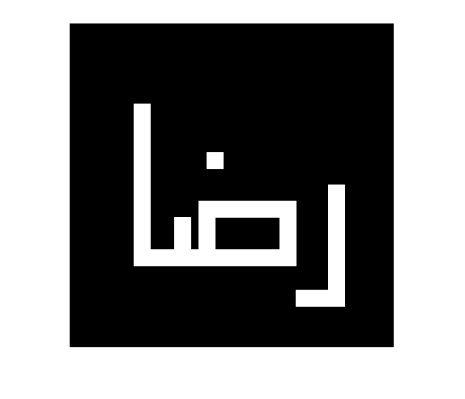

## تمرین 20
<div dir='rtl'>
  ساخت یک zeros برای نشان دادن تصویر
</div>
</br>

```
r = zeros(400);
```

<div dir='rtl'>
  ایجاد حرف ا 
</div>
</br>

```
for i=100:300
    for j=80:100
        r(i,j) = 1;
    end
end
```
<div dir='rtl'>
  ایجاد حرف ز 
</div>
</br>

```
for i=280:300
    for j=80:280
        r(i,j) = 1;
    end
end

for i=220:280
    for j=160:180
        r(i,j) = 1;
    end
end

for i=220:280
    for j=260:280
        r(i,j) = 1;
    end
end

for i=220:240
    for j=180:260
        r(i,j) = 1;
    end
end
```
<div dir='rtl'>
  ایجاد حرف ر 
</div>
</br>

```
for i=200:350
    for j=320:340
        r(i,j) = 1;
    end
end

for i=330:350
    for j=280:320
        r(i,j) = 1;
    end
end
```
<div dir='rtl'>
  ایجاد نقطه 
</div>
</br>

```
for i=160:180
    for j=170:190
        r(i,j) = 1;
    end
end
```
<div dir='rtl'>
  ایجاد دندانه 
</div>
</br>

```
for i=240:280
    for j=130:150
        r(i,j) = 1;
    end
end
```
<div dir='rtl'>
  نمایش تصویر
</div>

```
imshow(r);
```

<div dir='rtl'>
  خروجی کد :
</div>
</br>


