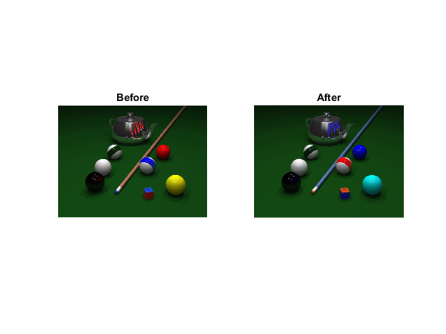

## تمرین 22
<div dir='rtl'>
تصویر را از ورودی خوانده و سایز تصویر را در x و y ذخیره میکنیم و در subplot تصویر اولیه را نمایش میدهیم.
</div>
</br>

```
image = imread("../../../benchmark/pool.png");
[x,y] = size(image);

subplot(1,2,1)
imshow(image);
title('Before');
```
<div dir='rtl'>
در ادامه یک ماتریس خالی ایجاد کرده و قسمت آبی تصویر را در آن قرار میدهیم و سپس به جای قسمت آبی قسمت قرمز را جایگذاری میکنیم و در نهایت هم به جای قسمت قرمز متغیر temp را قرار داده و تصویر نتیجه را نمایش میدهیم.
</div>
</br>

```
temp = zeros(x,y);

temp = image(:,:,3);
image(:,:,3) = image(:,:,1);
image(:,:,1) = temp;

subplot(1,2,2)
imshow(image);
title('After');
```
<div dir='rtl'>
  خروجی کد :
</div>
</br>


