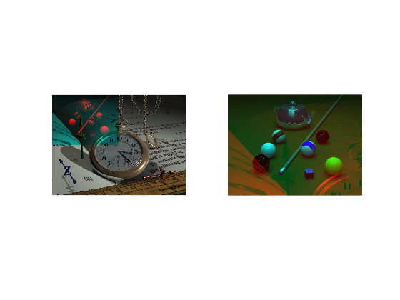

## تمرین 24
<div dir='rtl'>
تصاویر را از ورودی خوانده و سایز تصاویر را ذخیره میکنیم و سپس مولفه R تصاویر را در متغیر های جداگانه قرار میدهیم.
</div>
</br>

```
image_watch = imread("../benchmark/watch.png");
image_pool = imread("../benchmark/pool.png");

[x,y,z] = size(image_watch);
[s,t,u] = size(image_pool);

temp_watch = image_watch(:,:,1);
temp_pool = image_pool(:,:,1);
```
<div dir='rtl'>
در ادامه به اندازه ی سایز تصویر کوچکتر پیمایش را انجام میدهیم و در قسمت مولفه قرمز هر تصویر مولفه قرمز تصویر دیگر را قرار میدهیم و در نهایت هم با کمک subplot تصاویر را در خروجی نمایش می دهیم.
</div>
</br>

```
for i=1:s
    for j=1:t
        image_watch(i,j,1) = temp_pool(i,j);
        image_pool(i,j,1) = temp_watch(i,j);
    end
end

subplot(1,2,1);
imshow(image_watch);
subplot(1,2,2);
imshow(image_pool);
```
<div dir='rtl'>
  خروجی کد :
</div>
</br>


