

  
تشخیص کاراکترهای Captcha با الگوریتم های یادگیری ماشین با ناظر
 
#### چکیده
تمرکز اصلی این مقاله مقایسه ی چندین الگوریتم دسته بندی یادگیری ماشین برای تشخیص کد های کپچا است.بخش اصلی تحقیقات مطالعه ی تطبیقی شبکه های عصبی ، K- نزدیکترین همسایگان 
،ماشین های برداری و درخت های تصمیم که در محیط متلب پیاده سازی شده است. میزان موفقیت به دست آمده برای الگوریتم ها بالای 89 درصد است.تفاوت اصلی الگوریتم های استفاده شده
در زمان یادگیری آنها است.بر اساس اطلاعات به دست آمده این امکان وجود دارد که الگوریتم مناسبی را برای کار خاصی انتخاب کنیم.

### مقدمه

یافتن شاخه ی دیگری از حوزه ی سایبری که خیلی سریع و به طور مداوم افزایش می باید به عنوان بینایی ماشین سخت است. تکنیک ها ، روش ها و الگوریتم های بینایی کامپوتر ، طیف باورنکردنی از ترافیک ، صنعتی و سایر کارهایی را که برای سنجش بینایی در نظر گرفته شده است ، حل می کند. در اوایل دوران بینایی ماشین ، فقط کارهای ساده پردازش تصویر در صنعت انجام می شد. یک بررسی جامع و منظم را می توان در Malamas و همکاران یافت. این پیشگامان معمولاً بازرسی از حضور ، ابعاد یا رنگ محصول داده شده را انجام می دادند. این نوع بازرسی صنعتی به راحتی در وظایف معاصر صنایع غذایی ادامه دارد(به عنوان مثال برای بازرسی بطری های شیشه ای شرح داده شده در هوراک و همکاران (2009b)) ، تجزیه و تحلیل مواد بصری (به عنوان مثال طبقه بندی بصری سیم های فولادی اجرا شده در هوراک (2015)) و بسیاری دیگر. سیستم های نظارت و پایش سنتی همراه با سیستم های به اصطلاح ADAS دومین کلاس اصلی برنامه های بینایی ماشین هستند. یک مثال مناسب برای نظارت بر عملکرد برای تخمین صف ترافیک می توان در Siyal and Fathy (1995) یافت و نمونه های دیگر سیستم های ADAS به عنوان مثال در هوراک و همکاران توصیف شده است. (2009a) و در هوراک و کالووا (2010). علاوه بر صنعت و ترافیک ، چندین دامنه بعدی نیز از ابزارهای پردازش تصویر استفاده می کنند بازسازی صحنه سه بعدی برای رباتیک در محیط های داخلی و خارجی اغلب مورد مطالعه قرار می گیرد.به عنوان مثال ما اخیراً یک رویکرد جدید برای بازسازی استریو بدون کالیبره در کلکا و هوراک (2015) معرفی کرده ایم.

جای تعجب نیست که نه تنها شاخه های مهندسی ذکر شده در بالا از رایانه یا بینایی ماشین بسیار زیاد به عنوان یک ابزار راه حل استفاده می کنند. بسیاری از کاربردهای جالب پردازش تصویر و به ویژه روش های بازیابی تصویر (Deb and Zhang (2004)) در IT و شعب امنیتی اینترنت وجود دارد. یکی از کاربردهای مختلف پردازش تصویر در آخرین دامنه ذکر شده امنیت اینترنت ، مفهوم شناخته شده Captcha به عنوان نوعی از آزمون تورینگ است. فصل های بعدی فقط به استفاده از روش های بینایی رایانه و یادگیری ماشین در شناسایی خودکار Captcha اختصاص داده شده است.

#### مفهموم Captcha
ناشناس بودن سرویس های وب معمولاً منجر به وضعیتی می شود که برنامه های رایانه ای انسان را در کارهای یکنواخت جایگزین می کنند. سرویس های خودکار می توانند مقدار زیادی ایمیل ناخواسته ارسال کنند ، برای جستجوی اطلاعات در پایگاه های داده عمومی جستجو کنند یا بر مجموعه های آنلاین تأثیر بگذارند. در 20 سال گذشته ، تحقیقات زیادی در رابطه با این مشکل منتشر شده است. CAPTCHA (آزمون کاملاً خودکار تورینگ عمومی برای جدا کردن رایانه ها و انسان ها) به عنوان یک کار کلی تعریف می شود که حل آن برای انسان بسیار آسان است ، اما ایجاد یک ماشین خودمختار برای حل وظیفه هم برای منابع محاسباتی و هم برای پیچیدگی الگوریتم باید مشکل باشد (von Ahn et al. (2003)).

#### متن مبتنی بر CAPTCHA
رویکرد رایج ترین مورد استفاده برای پیاده سازی Captcha برای سرویس های وب ، مبتنی بر مسئله OCR (تشخیص نوری شخصیت) است الگوریتم های OCR فعلی می توانند بسیار قوی باشند ، اما ضعف هایی دارند این نقص استفاده از این الگوریتم ها را محدود می کند اما می تواند برای اهداف Captcha با مزیت بسیار زیاد مورد استفاده قرار گیرد. سرور تصویر را با دنباله ای از نویسه ها به سمت مشتری ارسال می کند. این تصویر به روشی تهیه شده است که از مسائل شناخته شده OCR در برابر رایانه استفاده می کند در همان زمان ، افرادی که الگوریتمی سعی در حل این نوع چالش های Captcha دارند به بهبود الگوریتم های OCR کمک می کنند (Kaur and Behal (2015)).
این فرآیند تکرار به طرفین غرفه کمک می کند ، اما توسعه تا کنون پیشرفت کرده است ، که طرح های فعلی Captcha برای کامپیوتر و انسان بسیار پیچیده است. بسیاری از چالش های کنونی Captcha بسیار پیچیده هستند ، به طوری که بشر نمی تواند آنها را حل کند ، اما ماشین ها می توانند آن را حل کنند. سیستم های همه کاره خودکار برای شکستن Captcha می توانند بسیاری از طرح ها را بدون هیچ نوع تعامل انسانی از بین ببرند. برخی از این سیستم ها را می توان برای یادگیری چالش ناشناخته Captcha اصلاح کرد. همانطور که تحقیقات قبلی در Bursztein و همکاران به ما نشان داد. (2011) ، این نوع سیستم می تواند تقریباً بر هر طرح ممکن Captcha با موفقیت بالا غلبه کند.
مطالعه قبلی Bursztein و همکاران (2011) چندین روش برای بهبود امنیت طرح های Captcha را توصیه می کند. اولین موردی که باید مورد استفاده قرار گیرد استفاده از نوعی تکنیک ضد تقسیم بندی است. بسیاری از سیستم ها از خطوط عبور از حروف استفاده می کنند ، اما اشتباه رایج در استفاده از خطوط طولانی (طولانی تر از اندازه یک حرف) است که می تواند با تبدیل Hough فیلتر شود. ساده ترین روش استفاده از طول کلمه کلیدی متغیر است که دشواری بیشتری را در حدس زدن موقعیت حروف جداگانه ایجاد می کند.
مرحله بعدی امنیت در سطح کاراکترهای تنها است. استفاده از نویسه ها از انواع مختلف فونت ها ، اندازه ها و چرخش ها ، تمرین خوبی است. از طرف دیگر ، استفاده از نویز تصادفی توصیه نمی شود زیرا الگوریتم های فعلی برای مدیریت نویز بهتر از مغز انسان هستند. همچنین توصیه نمی شود از نویسه های مشابه مثل شماره 0 ، حرف O و D بزرگ استفاده کنید ، که توسط انسان یا ماشین نمیتواند تشخیص داده شود.
یک ایده بسیار جالب به نام reCaptcha در von Ahn و همکاران توصیف شد. (2008). توسعه بعدی بعداً در گوگل برگزار شد. تخمین های تقریبی منتشر شده در von Ahn و همکاران. (2008) نشان داد که حدود 100 میلیون چالش Captcha هر روز با زمانهای مختلف از 5 تا 20 ثانیه حل شده است. این ما را به وضعیتی می رساند که بشریت هر روز ده ها سال را برای حل برنامه های Captcha هدر می داد.
پروفسور Ahn و تیم او سوالی را مطرح می کنند که چگونه می توان از این زمان استفاده کرد. راه حل ساده است. بایگانی ها حاوی تعداد زیادی اسناد هستند که دیجیتالی نشده اند. سیستم اصلی reCaptcha (شکل 1 را ببینید) از دو قسمت تشکیل شده است. مرحله آماده سازی با استفاده از دو الگوریتم OCR ، سعی در رونویسی مستقل سند ارسالی دارد سپس خروجی ها مقایسه می شوند. سپس قطعات مطابق علامت گذاری می شوند که به درستی حل شده اند. هرگونه اختلاف نظر در خروجی ها برای ایجاد چالش Captcha استفاده می شود von Ahn و همکاران (2008).

 

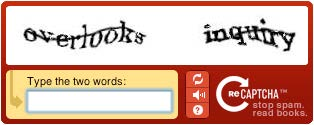
*شکل 1 : متن نمونه از google reCaptcha بر گرفته از Carnegie Mellon University(2010)*

 

#### CAPTCHA مبتنی بر تصویر
روش دیگر ایجاد چالش Captcha استفاده از تصاویر و تهیه آزمایشی است که در آن موضوع باید بگوید ، آنچه در تصویر است ، شباهت ها را پیدا کند یا شی خاصی را نشان دهد. این نوع آزمون Captcha کاربر پسندتر است و حل آن آسان تر از Captchas متنی است. یک مثال عالی طرح تصویر reCaptcha Google است که در شکل 2 نشان داده شده است
اخیراً مقاله ای Sivakorn و همکاران (2016) در توصیف راه غلبه بر این نوع چالش Captcha منتشر شد. قسمت اساسی استفاده از Google Reverse Image Search برای جمع آوری داده ها در مورد هر تصویر و استفاده از این اطلاعات در برابر reCaptcha گوگل است.

 

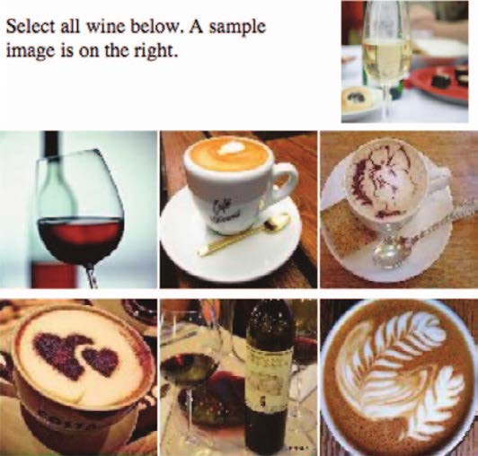
*شکل 2 : عکس نمونه google reCaptcha برگرفته از Sivakorn(2016)*

 

### یادگیری ماشین با ناظر
همانطور که قبلاً در فصل مقدمه ذکر شد و در میچل (1997) بیشتر توضیح داده شده ، یادگیری ماشین متوجه می شود که یک کارکرد f بین X (ویژگی های ورودی) و Y (خروجی مطلوب) استنباط می کند بدون اینکه صریحاً از عملکرد f استفاده کند روش های یادگیری ماشین به سه کلاس اصلی تقسیم می شوند:
یادگیری با ناظر ، بدون ناظر و نیمه نظارتی.
یادگیری با ناظر به این معنی است که برای هر رکورد (مورد) در مجموعه داده ، یک بردار ورودی از ویژگی های X و برچسب خروجی Y داریم. سپس ، برای یادگیری عملکرد نگاشت Y = f (X) از یک الگوریتم استفاده می کنیم هدف این است که تابع نگاشت که قبلاً ذکر شد تقریبی باشد ، این که یک پیش بینی خروجی Y از ورودی جدید X از یک برچسب ناشناخته به همان اندازه دقیق باشد که عملی باشد این یادگیری با ناظر نامیده می شود زیرا برچسب ها (طبقه بندی صحیح) شناخته شده اند یک مدل پیش بینی کننده به طور تکراری پیش بینی های داده های آموزش را محاسبه می کند (بخشی از یک مجموعه داده) و به طور ضمنی توسط الگوریتم یادگیری بر اساس عملکرد به اصطلاح ضرر اصلاح می شود. فرآیند یادگیری هنگامی متوقف می شود که خطای کلی مدل در حد تعیین شده قرار گیرد.
توجه داشته باشید که وظایف یادگیری با ناظر (bishop (2006)) بیشتر به رگرسیون و طبقه بندی تقسیم می شوند ، جایی که طبقه بندی به این معنی است که برچسب خروجی یک کیفیت است (یا یک دسته ، به عنوان مثال روشن / تاریک ، سالم / ناسالم و غیره). برعکس ، رگرسیون به معنای خروجی به عنوان یک مقدار (یا عدد ، به عنوان مثال 42 MPH ، 77 کیلوگرم و غیره) است. تقریباً همه وظایف عملی یادگیری ماشین منجر به یادگیری با ناظر می شود و همچنین وظیفه شناسایی CAPTCHA در این مقاله یادگیری نظارت شده را به کار می گیرد.
یادگیری بدون نظارت وضعیتی را نشان می دهد که ما داده های ورودی X را بدون برچسب مربوط به ویژگی خروجی Y داریم. چنین وظایفی از یادگیری بدون ناظر به طور کلی در مشکلات خوشه بندی و ارتباط دسته بندی می شوند. در بخشهای زیر ، فقط روشهایی که برای آزمایشهای ما انتخاب شده اند به طور کوتاهی شرح داده می شوند. همه آنها تحت گروه یادگیری با ناظر قرار می گیرند. یعنی درختان تصمیم ، K- نزدیکترین همسایگان ، ماشین های برداری و شبکه های عصبی مصنوعی پشتیبانی می کنند.

#### درختان تصمیم
درخت تصمیم یکی از تکنیک های داده کاوی است که با وضوح و تفسیر پذیری آسان مشخص می شود. نتایج بدست آمده را می توان به سرعت ارزیابی کرد ، موارد اصلی را به راحتی شناسایی و برای بخشهای مورد علاقه جستجو کرد. هدف درختان تصمیم گیری شناسایی اشیایی است که با ویژگی های مختلف در کلاس طبقه بندی می شوند. تصمیمات لازم برای بدست آوردن نتایج در یک ساختار درخت مانند قرار می گیرند ، که بسیار سریع است.درخت تصمیم باید در نتیجه مرحله یادگیری با استفاده از داده های آموزش ایجاد شود.
هر گره درخت نشان دهنده تصمیم گیری توسط یک خاصیت (انتخاب شده) شی است ، در نتیجه تعداد نهایی لبه های آن گره ایجاد می شود. گره باید اشیا را به بهترین شکل ممکن تشخیص دهد. برای گره ریشه ، یک ویژگی برای تشخیص اشیا از یکدیگر انتخاب شده است. بنابراین ، از آنتروپی (نرخ اطلاعات ویژگی) استفاده می شود.الگوریتم های معمول استفاده شده برای ایجاد درخت ID3 ، C4.5 و CART (Rokach and Maimon (2014)).

#### K- نزدیکترین همسایگان
الگوریتم k-Nearest همسایه ها (k-NN) طراحی شده در آلتمن (1992) الگوریتم یادگیری ماشین برای تشخیص الگو است که برای طبقه بندی و رگرسیون استفاده می شود. مرحله یادگیری فقط از ذخیره تمام الگوها تشکیل شده است. به همین دلیل است که ما آن را "یادگیری تنبل" می نامیم. در مرحله استقرار ، فاصله از تمام الگوهای ذخیره شده تا الگوی ناشناخته محاسبه می شود. سپس خروجی تنظیم می شود به عنوان متداول ترین مقدار از نزدیکترین همسایه k.
سرعت سریع مرحله یادگیری و توانایی افزایش بازده با اضافه کردن پویا الگوی جدید با خروجی های شناخته شده از مزایای اصلی این الگوریتم یادگیری ماشین است. نقطه ضعف اصلی این واقعیت است که برای طبقه بندی هر الگوی ناشناخته باید هر فاصله زمان بر از هر الگوی ذخیره شده محاسبه شود. الگوریتم همچنین به نویز حساس است داده ها چون هیچگونه تعمیم ایجاد نمی کند.

#### پشتیبانی از ماشین های برداری
پشتیبانی از ماشین های برداری (SVM) طراحی شده در Cortes و Vapnik (1995) الگوریتم طبقه بندی یادگیری ماشین است که در بالای فضای ویژگی کار می کند و سعی در پیدا کردن تقسیم بهینه صفحه دارد. ابر صفحه ی تقسیم به عنوان ابر صفحه با حداکثر مقدار حداقل فاصله بین داده های طبقه بندی از صفحه تعریف می شود. این بدان معنی است که ابر صفحه حداکثر حاشیه را بین دو گروه حفظ می کند. برای تعیین مرزهای بین این دو گروه ، فقط چند نقطه نزدیک به ابر صفحه لازم است. به این نقاط مرزی بردارهای پشتیبانی گفته می شود و از آنها نام این روش گرفته شده است
ابر صفحه ی تقسیم شده با معادله 1 تعریف می شود:

 

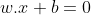

 

که در آن w بردار عادی برای ابر صفحه است ، x بردار نقاط ورودی است و b جبران ابر صفحه از مبدا Cortes و Vapnik است (1995).
شرط اولیه این مسئله در معادله 2 بیان شده است:

 

  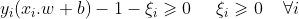
  
 

که در آن yi = 1 برای تمام امتیازات از یک کلاس و yi = −1 برای امتیازات از کلاس دیگر. از پارامتر اختیاری i می توان در طبقه بندی داده های پر سر و صدا استفاده کرد و قیمت تخلف از ابر صفحه ی تقسیم را بیان می کند.
یادگیری به صورت ریاضی با معادله 3 تعریف می شود:

 

  

 

که در آن C یک پارامتر تنظیم پذیر اختیاری است که نشان دهنده جریمه شدن نقاط اشتباه طبقه بندی شده است.
معادله فوق برای مسائل قابل تفکیک خطی طراحی شده است. برای مسئله غیر خطی ، SVM از ترفند هسته استفاده می کند که فضای ویژگی را به ابعادی بالاتر تبدیل می کند که در آن می توان ابر هواپیمای تقسیم را همانطور که در Boser و همکاران شرح داده شده است ، یافت. (1992)

#### شبکه های عصبی مصنوعی
شبکه های عصبی مصنوعی (ANN) ساختار شبیه سازی سلولهای عصبی بیولوژیکی و ارتباطات متقابل آنها است (bishop (2006)). نورونها عملاً به روشی متصل می شوند که امکان انتقال اطلاعات از طریق شبکه از ورودی به خروجی را فراهم می کند. شبکه های عصبی معمولاً از چندین نورون تشکیل شده است که به چندین لایه تقسیم شده اند
در طول مرحله یادگیری ، داده های نمونه به شبکه ارائه می شوند و خروجی شناخته شده با خروجی واقعی مقایسه می شود و برای اصلاح رفتار شبکه ها از تفاوت استفاده می شود. یک رویکرد رایج خطای پس انتشار نام دارد که الگوریتم گسترش خطا از خروجی به ورودی به منظور اصلاح مقدار
وزن و بهبود عملکرد شبکه. مرحله یادگیری از طریق تمام داده های نمونه تکرار می شود و تا زمانی که عملکرد عملکرد به مقدار مورد نظر برسد ، طول می کشد

### روش شناسایی ارائه شده
همانطور که قبلاً اشاره کردیم ، یکی از عناصر اصلی موفقیت برنامه Captcha مبتنی بر متن ، استفاده از چندین فونت است ، به Bursztein و همکاران مراجعه کنید. (2011). تحقیقات ما از این توصیه استفاده می کند و برای بهبود آن ، ما به فکر تولید فونت به صورت پویا برای هر کاراکتر هستیم. هدف Bubble Captcha استفاده از نوعی تصاویر Rorschach مبتنی بر متن است ، به Rorschach (1998) مراجعه کنید.
حتی اینکه هدف اولیه تصاویر Rorschach ارزیابی وضعیت روانی انسان ها بود و حتی برخی از مردم می توانند آنها را نوعی هنر انتزاعی ببینند ، این نوع تصاویر Captcha برای تمایز بین انسان و کامپیوتر بسیار مفید خواهد بود. این ایده بر اساس نارسایی تخیل ماشین آلات است. البته ، به کارگیری نوعی از تکنیک های یادگیری ماشین می تواند از تخیل تقلید کند ، اما امیدواریم که با تولید انتزاع مناسب در نسل Captcha ، Captcha یک چالش سخت برای کامپیوترها باشد اما برای انسان ها آسان باشد

#### مفهوم حباب CAPTCHA
در کار قبلی Bostik و همکاران (2017) ، ما طرح Captcha دو رنگ ابتدایی را با حلقه ها / حباب هایی که به طور تصادفی قرار گرفته اند و فونت را تشکیل می دهند ، ایجاد کردیم. این سیستم به عنوان یک برنامه وب در PHP طراحی شده است. دلیل اصلی تهیه یک بستر برای آزمایش سریع Bubble Captcha با طیف گسترده ای از افراد بود.این سیستم می تواند پارامتر شود و می تواند برای ایجاد چالش Captcha منفرد برای اهداف امنیتی در صفحات وب مورد استفاده قرار گیرد یا می تواند برای تولید سریع مجموعه آزمایش الگوریتم های OCR مورد استفاده قرار گیرد.
یک آرایه دو بعدی که شبکه باینری را برای هر کاراکتر مورد استفاده نشان می دهد ، یکی از عناصر اصلی است که وارد الگوریتم می شود. الگوریتم تولید به طور تصادفی کاراکترها را از مجموعه کاراکترهای مورد استفاده انتخاب می کند و آنها را به صورت حباب قرار می دهد

 

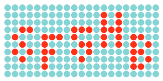
*(a) بدون جابجایی*
 
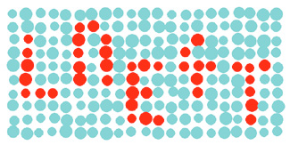
*(b) جابجایی متوسط*
 
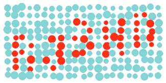
*(c) جابجایی بزرگ*
 

*شکل 3 : نمایش گونه های حباب captcha*

 

توسط حباب برای ایجاد طرح Captcha ما همراه با حباب های رنگی دیگر.هر حباب به طور تصادفی تقریباً در موقعیت صحیح خود در شبکه قرار می گیرد و به طور تصادفی در اندازه در محدوده های از پیش تعریف شده مقیاس بندی می شود.سه نوع مختلف (که از این پس به عنوان a ، b و c نشان داده می شوند) Bubble Captcha از این طریق به عنوان مجموعه داده ورودی الگوریتم های یادگیری ماشین تحت نظارت تولید می شوند.طرح Captcha اجرا شده در شکل 3 نشان داده شده است که 3 سطح اصلی تصادفی را در تصویر نشان می دهد.

#### استخراج ویژگی
تصاویر حباب Captcha که در شکل قبلی نشان داده شده است ، برای اطمینان از ورود مناسب به روش های یادگیری ، پیش پردازش شده اند. هر کلمه Captcha به کاراکترهای جداگانه تقسیم می شود. این کار توسط خطوط عمودی مشخص انجام می شود زیرا فاصله بین همه کاراکترها یکسان است و دقیقاً از مرحله ایجاد مجموعه داده مشخص است. نمونه ای از حرف R جدا شده از کلمه Captcha در شکل 4 (a) نشان داده شده است.

 

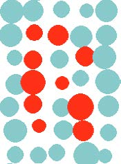
*(a) حرف اصلی تقسیم بندی شده*
 
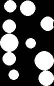
*(b) تصویر باینری*
 

*شکل 4 : استخراج ویژگی بر اساس رنگ*

 

مرحله بعدی یک تقسیم بندی رنگ از شخصیت جدا شده است. در این مرحله یک آستانه رنگ ساده به کار می رود. همه پیکسل های دارای مقدار کانال قرمز بالاتر از آستانه مشخص شده به عنوان پیکسل نامه و بقیه به عنوان پیکسل پس زمینه طبقه بندی می شوند. علاوه بر این ، یک منطقه تقسیم شده از شخصیت به ابعاد 102 در 172 پیکسل نرمال می شود. نتیجه چنین تقسیم بندی رنگ با نرمال سازی در شکل 4 (b) به عنوان یک تصویر باینری نشان داده شده است.
آخرین مرحله از مرحله استخراج ویژگی ، خطی شدن تصویر کاراکتر باینری است. مقادیر تمام پیکسل های تصویر به طور پی در پی و توسط یک طرح خام در کنار یکدیگر در حالت خام قرار می گیرند. این تجزیه تصویر در برشی به طول 17544 مقدار بازده دارد و به صورت شماتیک در شکل 5 (ب) نشان داده شده است.
مرحله استخراج ویژگی به بردار طول داده شده و همیشه یکسان منتج می شود. این بردار به عنوان ورودی به مدلهای یادگیری ماشین است که در زیر توضیح داده شده است.

### آزمایش
در فصل زیر آزمایشات انجام شده در محیط محاسبات MATLAB با جعبه ابزار آماری و یادگیری ماشین و جعبه ابزار بهینه سازی شرح داده شده است.

 

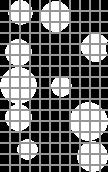
*(a) تصویر باینری دو بعدی*
 
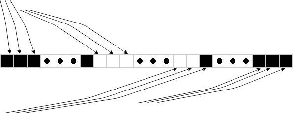
*(b) بردار ورودی با طول 17544*
 
*شکل 5 : مرتب سازی مجدد ماتریس بر اساس بردار ورودی*

 

#### نمای کلی گالری ورودی
گالری بزرگی از شخصیت مصنوعی با ژنراتور PHP که در بالا توضیح داده شد ، ایجاد شد. برای آزمایشات اولیه ، ما از همان سه سطح تحریف استفاده می کنیم که در طرح Bubble Captcha قبلاً آزمایش شده است. پارامترهای اصلی در جدول زیر نشان داده شده است.

 

*جدول 1 :*

تخریب موقعیت حباب | تخریب اندازه حباب | مرحله شبکه | گونه
------------ | ------------- | ------------ | -------------
0% | 0% | 35 | a
20% | 10% | 35 | b
30% | 15% | 35 | c

 

در طرح های رایج Captcha از کاراکترهای یکسانی استفاده نمی شود که به راحتی با یکدیگر اشتباه گرفته می شوند (به عنوان مثال شماره صفر و حرف O). به همین دلیل ، گالری ورودی شامل 33 مجموعه شخصیت مختلف است. هر مجموعه کاراکتر شامل 50 نمونه برای هر نوع است.
در پایان ، گالری شامل 4950 نمونه کاراکتر است.

#### K- نزدیکترین همسایگان
اولین الگوریتم طبقه بندی مورد استفاده الگوریتم طبقه بندی K- نزدیکترین همسایگان بود. تنظیم استاندارد مورد استفاده قرار گرفت ، طبقه بندی الگوریتم دقیقاً بر اساس یک عنصر نزدیک بود. هنگامی که بیش از یک عنصر ذخیره شده فاصله یکسانی از مورد طبقه بندی شده داشته باشد ، الگوریتم یکی را با کمترین شاخص انتخاب می کند (اعداد و حروف به ترتیب حروف الفبا با اعداد قبل مرتب می شوند نامه ها).
فاصله اقلیدسی بدون وزن به عنوان متریک برای ارزیابی الگوریتم استفاده شد. محاسبه فواصل از الگوریتم جامع بدون بهینه استفاده می کند ، به این معنی که تمام فواصل ارزیابی می شوند. بدون تغییر نمره استفاده شده است.
همانطور که انتظار می رفت ، الگوریتم k-NN سریعترین قابل یادگیری است - فقط از تمام الگوی یادگیری ذخیره می کند. در تناقض ، الگوریتم در مرحله طبقه بندی به دلیل محاسبه فاصله کامل ، آهسته ترین است.

#### شبکه های عصبی مصنوعی تشخیص الگو
شبکه های عصبی مصنوعی شناسایی الگو یک شبکه عصبی پیشگام است که می تواند برای شناسایی الگو و طبقه بندی به کلاسهای هدف مورد استفاده قرار گیرد.
این شبکه عصبی از یک لایه ورودی ، دو لایه مخفی و لایه خروجی تشکیل شده است. لایه ورودی با 17544 نورون فقط سیگنال را به شبکه منتقل می کند. دو لایه پنهان تقریباً یکسان هستند - هر دو از روش اولیه Nguyen-Widrow استفاده می کنند ، هر دو دارای عملکرد انتقال سیگموئید مماس هذلولی هستند ، نورون ها در هر دو لایه از جمع وزن و تعصبات به عنوان یک تابع ورودی استفاده می کنند. لایه پنهان مشت شامل 200 نورون و لایه مخفی دوم از 50 نورون تشکیل شده است. لایه خروجی دارای 33 نورون با عملکرد انتقال Soft Maximum است. پارامترهای باقی مانده لایه خروجی همانند لایه های مخفی هستند
عملکرد شبکه بر اساس آنتروپی متقابل با معادله 4 ارزیابی می شود:

 

  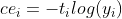

 

جایی که yi داده های خروجی و ti داده های هدف جفت مقادیر i-th مقادیر خروجی هستند. آنتروپی متقابل متقاطع به عنوان میانگین مقادیر آنتروپی متقابل فردی ارزیابی می شود (bishop (2006)). برای یادگیری از مقادیر متقابل شیب متصل به مزدوج توصیف شده در مولر (1993) استفاده شد. حداکثر تعداد دوره به 1000 و حداقل شیب به 1e-6 تنظیم شده است.)
پیشبرد شبکه های عصبی مصنوعی
برای مقایسه نتایج با یک شبکه عصبی جهانی از پیاده سازی استاندارد یک شبکه عصبی در MATLAB استفاده شد. پارامترها و توپولوژی تقریباً یکسان هستند. اولین تفاوت از دو تفاوت اصلی استفاده از یک تابع خطی یکسان در لایه خروجی بود. تفاوت دوم تابعی برای محاسبه عملکرد شبکه بود - میانگین خطای نرمال مربع.
درختان تصمیم
در این روش ، درخت تصمیم رگرسیون باینری متناسب با داده ها بود. برای ایجاد درخت تصمیم ، از الگوریتم استاندارد CART استفاده شد. معیار تقسیم مورد استفاده در این کار ، شاخص تنوع Gini بود.

درخت تصمیم از هیچ تغییر نمره ای استفاده نمی کند. درخت تصمیم نهایی که با گالری ورودی توصیف شده ایجاد شده است ، در کل 65 گره دارد. هیچ گونه هرس روی درخت نهایی اعمال نشد ، اما تمام گره های کودک با خطر بیشتر یا برابر با خطر گره های اصلی ادغام می شوند.

#### پشتیبانی از ماشین های برداری
الگوریتم یادگیری مورد استفاده برای ایجاد طبقه بندی بر اساس الگوریتم تصحیح خطا در کدهای خروجی (ECOC) Dietterich and Bakiri (1994) عمل می کند. این روش طبقه بندی باینری SVM را گسترش می دهد تا برای تقسیم بندی طبقه ها چند طبقه استفاده شود. این پیاده سازی خاص از طراحی کدگذاری یک به یک استفاده می کند ، به این معنی که برای هر ترکیبی از دو کلاس در مجموعه یادگیری ، یکی مثبت اعلام می شود ، کلاس دوم منفی اعلام می شود و بقیه کلاس ها حذف می شوند. تعداد فراگیران دودویی حاصل از کلاسهای K K (K - 1) / 2 است.
برای ارزیابی عملکرد هر زبان آموز ، ضرر باینری با تابع Hinge توصیف شده در رابطه 5 محاسبه می شود:

 

  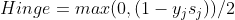

 

که در آن yj برچسب کلاس برای باینری یادگیرنده و sj نمره برای مشاهده j است.

#### ارزیابی آزمایشات
در طول این آزمایش دو جنبه اصلی مقایسه می شود. مورد اول میزان موفقیت هر الگوریتم است. همانطور که در جدول 2 مشاهده می شود ، بهترین میزان موفقیت توسط شبکه عصبی مصنوعی شناخت الگو به دست آمد که در داده های نمونه ارائه شده ، موفقیت 100٪ است. طبقه بندی ماشین بردار پشتیبان با تنها 2 طبقه بندی غلط که منجر به موفقیت 98.80٪ می شود در مکان دوم قرار گرفت.
بدترین طبقه بندی شده شبکه عصبی مصنوعی Feed-Forward بود. این الگوریتم برای الگوی کار طبقه بندی طراحی نشده است و با موفقیت٪ 79/98 به پایان رسید. با وجود این ، نتایج بسیار خوب است و نشان دهنده قدرت شبکه عصبی مصنوعی است.

 

*جدول 2 :*

algorithm | true positive | false positive | precision 
------------ | ------------- | ------------ | -------------
KNN | 980 | 10 | 98.99%
Pattern Net | 990 | 0 | 100.00%
Feed Forward Net | 978 | 12 | 98.79%
Decision Tree | 980 | 10 | 98.99%
SVN | 988 | 2 | 99.80%

 

جنبه دوم برای مقایسه ، زمان مصرف و به این ترتیب پیچیدگی محاسباتی هر الگوریتم جداگانه است. نتایج در جدول 3 نشان داده شده است.
یکی از پارامترهای دو زمانه ، یادگیری زمان Tlearn است. برنده آشکار الگوریتم K- نزدیکترین همسایگان است

 

*جدول 3 :*

algorithm | TLearn | TClass | TComb | Comparation 
------------ | ------------- | ------------ | ------------- | -------------
KNN | 1.37 | 716.12 | 717.50 | 7.95%
Pattern Net | 565.33 | 192.61 | 757.94 | 8.40%
Feed Forward Net | 8827.57 | 193.49 | 9021.06 | 100.00%
Decision Tree | 21.52 | 1.67 | 23.19 | 0.26%
SVN | 314.97 | 322.17 | 637.14 | 7.06%

 

دلیل سادگی مرحله یادگیری - ذخیره تمام الگوها بسیار کارآمد است. درختان تصمیم کمی کندتر هستند ، اما زمان حاصل از 20 ها نیز خوب است. کندترین پیش بینی کننده برای یادگیری شبکه عصبی مصنوعی Feed-Forward نامناسب با مرحله یادگیری است که تقریباً 2 ، 5 ساعت طول می کشد.
بهترین زمان طبقه بندی با الگوریتم درخت تصمیم به دست آمد. بدترین زمان با الگوریتم K- نزدیکترین همسایگان به دلیل ماهیت یادگیرنده تنبل طبقه بندی ثبت شد. دو نمونه از شبکه های عصبی به دلیل اندازه و توپولوژی یکسان ، تقریباً زمان طبقه بندی یکسانی دارند.

در پایان باید برخی از یادداشت ها را ذکر کنیم. جدول 2 فقط ستونهای True مثبت و False مثبت را نشان می دهد. مقادیر دیگر به دلیل صفر بودن مقادیر نشان داده نمی شوند ، زیرا همه طبقه بندی کننده ها در همه موارد برخی از کاراکترها را برمی گرداند. همچنین ، ستون Tcomb در جدول 3 فقط ویژگی اطلاعاتی دارد.

### نتیجه گیری
این کار الگوریتم های یادگیری ماشین نظارت شده معمول را برای شناسایی نوری کدهای Captcha مقایسه می کند. آزمایش های ما نشان می دهد که همه الگوریتم های مورد استفاده می توانند اشیا را با موفقیت در حدود 99٪ در کلاس مناسب طبقه بندی کنند. تفاوت اصلی بین الگوریتم در هزینه های محاسباتی است. برنده کلی در هر دو دسته ، شبکه عصبی شناخت Patter است زیرا هم دقت و هم هزینه محاسباتی پایینی دارد.

همچنین تفاوت زیادی بین دو الگوریتم شبکه عصبی تقریباً مشخص وجود دارد. شبکه عصبی نامناسب استفاده شده به نام Feed-forward net که برای تشخیص الگو بهینه نشده بود ، در مرحله یادگیری برای دستیابی به عملکرد صحیح دچار مشکلات بزرگی بود.

کارهای زیر ما بر روی بهبود طرح Bubble Captcha متمرکز خواهد بود. ما می خواهیم با استفاده از این تحقیق میزان موفقیت این نسخه بهبود یافته Bubble Captcha را در برابر حل کننده های خودکار آزمایش کنیم.

#### سپاسگزاری ها
تکمیل این مقاله با کمک هزینه شماره FEKT-S-17-4234 - "صنعت 4.0 در خودکار سازی و سایبرنتیک" که توسط صندوق علمی داخلی دانشگاه فنی و مرکز صلاحیت های دانشگاه برنو پشتیبانی می شود ، تحقق یافته است. TACR (شماره ثبت TE01020197).

