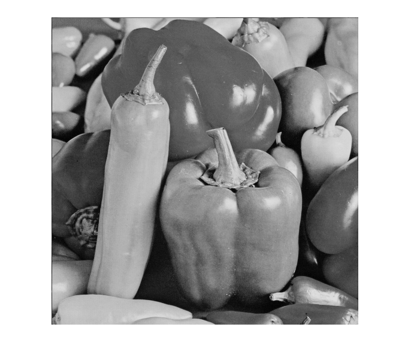

## تمرین 3
<div dir='rtl'>
  با دستور imread  تصویر را میخوانیم و سپس قسمت های مربوط به RGB را در متغیر های جداگانه قرار می دهیم و سایز تصویر مورد نظر را گرفته و با استفاده از تابع zeros به اندازه ی ابعاد تصویر  اولیه یک صفحه خالی ایجاد میکنیم 
</div>
</br>

```
image = imread("peppers.png");

R = image(:,:,1);
G = image(:,:,2);
B = image(:,:,3);

[M,N,~] = size(image);
Gray_image = zeros(M,N,'uint8');

```
<div dir='rtl'>
  در ادامه کل صفحه را پیمایش کرده و با فرمول مورد نظر که در کد استفاده شده است تغییرات را برای تمامی پیکشل ها اعمال میکنیم و در آخر هم تصویر را نمایش می دهیم.
</div>
</br>

```
for i=1:M
    for j=1:N
        Gray_image(i,j) = (0.299*R(i,j)) + (0.587*G(i,j)) + (0.114*B(i,j));
    end
end

imshow(Gray_image);
```
<div dir='rtl'>
  خروجی کد :
</div>
</br>


