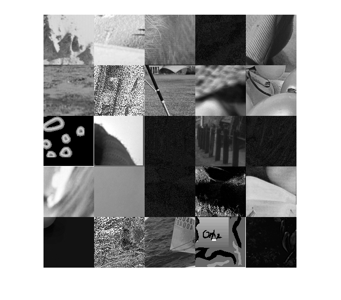

## تمرین 4
<div dir='rtl'>
 یک ماتریس 500 در 500 از نوع uint8 ایجاد میکنیم و مسیری که تصاویر در آن قرار دارند را مشخص میکنیم و در یک متغیر از نوع imageDatastore قرار میدهیم.
</div>
</br>

```
pic = uint8(zeros(500,500));
fileFolder = fullfile(matlabroot,'bin','img');
imds = imageDatastore(fileFolder,'FileExtensions',{'.tif','.png','.bmp'});
```
<div dir='rtl'>
 در ادامه از پیکسل اول شروع کرده و 100 تا 100 تا جلو میرویم و به اندازه ی 100 پیکسل از پایین تصویر جدا میکنیم و در ماتریس قرار میدهیم
</div>
</br>

```
s=1;
for i=1:100:500
    for j=1:100:500
        if s<=25
            image = readimage(imds,s);
            [x,y] = size(image);
            image = image(x-99:x,y-99:y);
            pic(i:i+99,j:j+99) = image;
            s=s+1;
        end
    end
end
```
<div dir='rtl'>
  خروجی کد :
</div>
</br>


