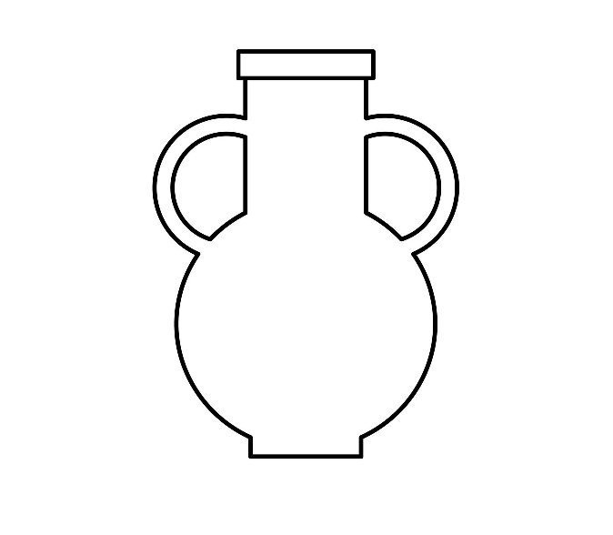

## تمرین 5
<div dir='rtl'>
  ابتدا با دستور imread تصویر را خوانده و سپس اندازه تصویر را با کمک size میگیریم و به اندازه ی دو برابر عرض تصویر یک تابع zeros ایجاد میکنیم و  تصویر اصلی را با تابع flip وارون میکنیم در انتها نیز با کمک cat  دتصویر را به هم میچسبانیم و تصویر نهایی را نمایش می دهیم.
</div>
</br>

```
image = imread("img/jug.jpg");
imageSize = size(image);
result = zeros(imageSize(1,1),imageSize(1,2)*2,'uint8');
flipimage = flip(image,2);

result = cat(2,flipimage,image);

imshow(result);
```

