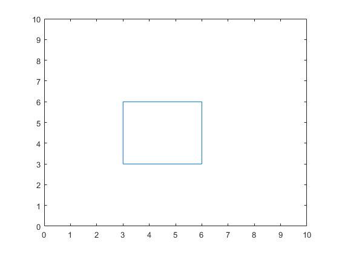
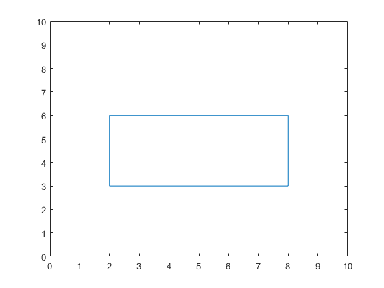
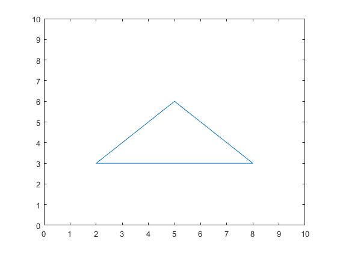
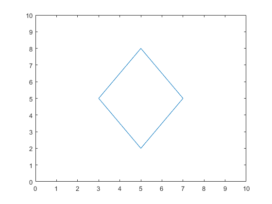

## تمرین 7
<div dir='rtl'>
  برای رسم هر شکل به صورت جداگانه مختصات مربوط به اضلاع را مشخص میکنیم و با تابع plot آنها را رسم میکنیم.
</div>
</br>

```
%Square
x = [3,6,6,3,3];
y = [3,3,6,6,3];
figure
plot(x,y);
axis([0 10 0 10])

%Rectangle
x = [2,8,8,2,2];
y = [3,3,6,6,3];
figure
plot(x,y);
axis([0 10 0 10])

%Rhombus
x = [3,5,7,5,3];
y = [5,2,5,8,5];
figure
plot(x,y);
axis([0 10 0 10])

%Triangle
x = [2,8,5,2];
y = [3,3,6,3];
figure
plot(x,y);
axis([0 10 0 10])
```
<div dir='rtl'>
  خروجی کد :
</div>
</br>





