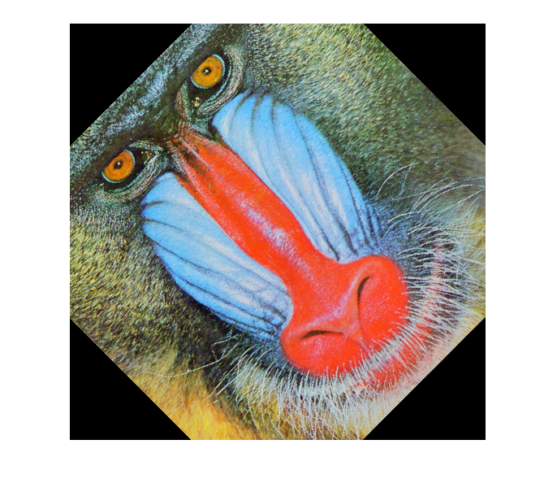
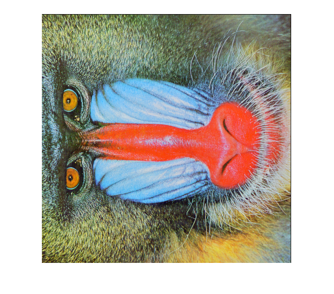
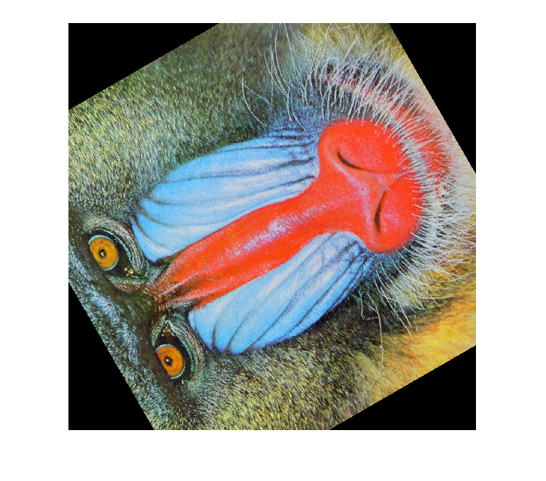
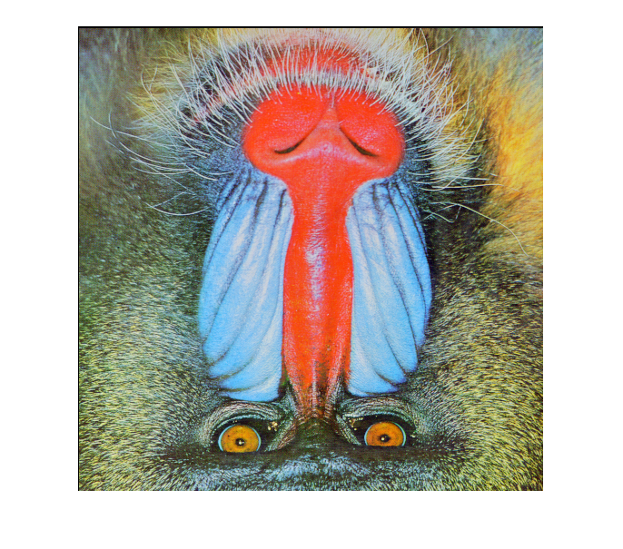

## تمرین 8
<div dir='rtl'>
  تصویر را از ورودی خوانده و سایز تصویر را برمیداریم و درجه های خواسته شده در صورت سوال را در آرایه degree قرار میدهیم
</div>
</br>

```
imagepad = imread("baboon.png");
[nrows ncols nslices] = size(imagepad);
midx=ceil((ncols+1)/2);
midy=ceil((nrows+1)/2);

degree = [pi/4,pi/2,2*pi/3,pi];

```

<div dir='rtl'>
   
</div>
</br>

```
for i=1:4
    Mr = [cos(degree(i)) sin(degree(i)); -sin(degree(i)) cos(degree(i))];
    
    [X Y] = meshgrid(1:ncols,1:nrows);
    XYt = [X(:)-midx Y(:)-midy]*Mr;
    XYt = bsxfun(@plus,XYt,[midx midy]);

    xout = round(XYt(:,1)); 
    yout = round(XYt(:,2));
    outbound = yout<1 | yout>nrows | xout<1 | xout>ncols;
    zout=repmat(cat(3,1,2,3),nrows,ncols,1);
    zout=zout(:);
    xout(xout<1) = 1;
    xout(xout>ncols) = ncols;
    yout(yout<1) = 1;
    yout(yout>nrows) = nrows;
    xout = repmat(xout,[3 1]);
    yout = repmat(yout,[3 1]);
    imagerot = imagepad(sub2ind(size(imagepad),yout,xout,zout(:)));
    imagerot = reshape(imagerot,size(imagepad));
    imagerot(repmat(outbound,[1 1 3])) = 0;
    figure;
    imshow(imagerot);
end

```

<div dir='rtl'>
  خروجی کد :
</div>
</br>





