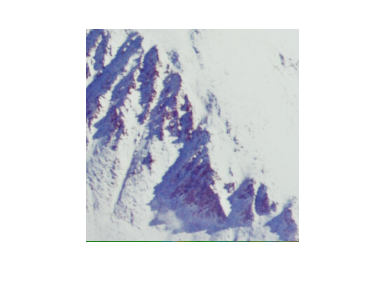

## تمرین 9
<div dir='rtl'>
  از ورودی دو مقدار به عنوان طول و عرض برش را میگیریم و بعد از خواندن تصویر با دستور imread  به دستور imcrop برش مورد نظر را اعمال میکنیم.
</div>
</br>

```
a = input('Enter a : ');
b = input('Enter b : ');

image = imread("../../../benchmark/airplane.png");
CropImage = imcrop(image,[a b a b]);

imshow(CropImage);
```
<div dir='rtl'>
  خروجی کد :
</div>
</br>


