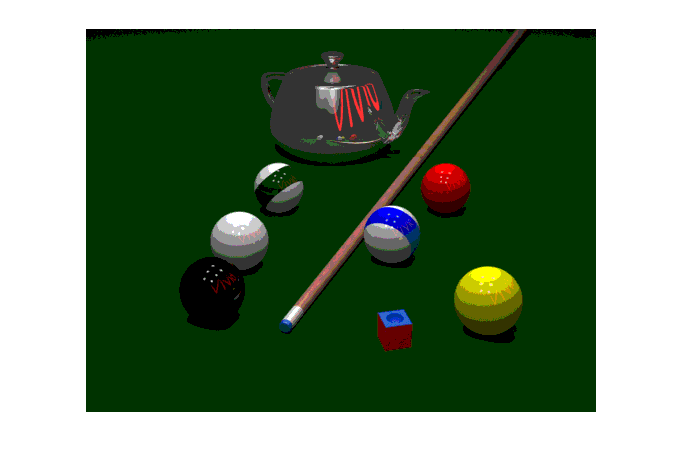

## تمرین 1
<div dir='rtl'>
تصویر را از ورودی خوانده و سایز تصویر را در x و y ذخیره میکنیم و پیکسل های تصویر را به ضریب 51 تبدیل میکنیم.
</div>
</br>

```
image = imread("../../benchmark/pool.png");
[x,y] = size(image);
image = (image/51);
```
<div dir='rtl'>
پیکسل های تصویر را پیمایش کرده و آنها را در 51 ضرب میکنیم تا safe color ایجاد شود. علت ضرب در 51 هم این است که safe color میتواند 0 و 51 و 102 و 153 و 204 و 255 باشد.
</div>
</br>

```
i=1;
while(i<=x)
   j=1;
   while(j<=y)
        image(i,j) = (image(i,j))*51;
        j=j+1;
   end
   i=i+1;
end

imshow(image);
```
<div dir='rtl'>
  خروجی کد :
</div>
</br>


