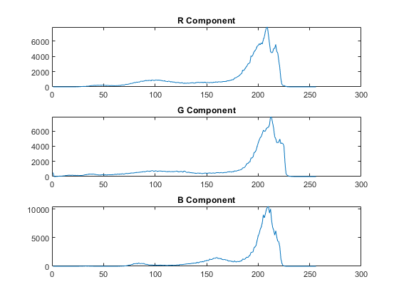

## تمرین 3
<div dir='rtl'>
تصویر را از ورودی میخوانیم و قسمت های قرمز و سبز و آبی را به صورت جداگانه به تابع p3_histogram میدهیم تا هیستوگرام را برای آنها به صورت جداگانه محاسبه کند و سپس برای مقادیر برگشتی از تابع هیستوگرام نمودار رسم میکنیم.
</div>
</br>

```
image = imread("../../benchmark/airplane.png");

r = p3_histogram(image(:,:,1));
g = p3_histogram(image(:,:,2));
b = p3_histogram(image(:,:,3));

subplot(3,1,1)
plot(r);
title('R Component');
subplot(3,1,2)
plot(g);
title('G Component');
subplot(3,1,3)
plot(b);
title('B Component');
```

<div dir='rtl'>
تابع p3_histogram:
</div>
</br>

```
function [colours] = imhistogram(image)

[x,y] = size(image);
colours = zeros(1,256);
for i=1:x
    for j=1:y
        z = image(i,j);
        colours(z + 1) = colours(z + 1) + 1;
    end
end

end
```


<div dir='rtl'>
  خروجی کد :
</div>
</br>


