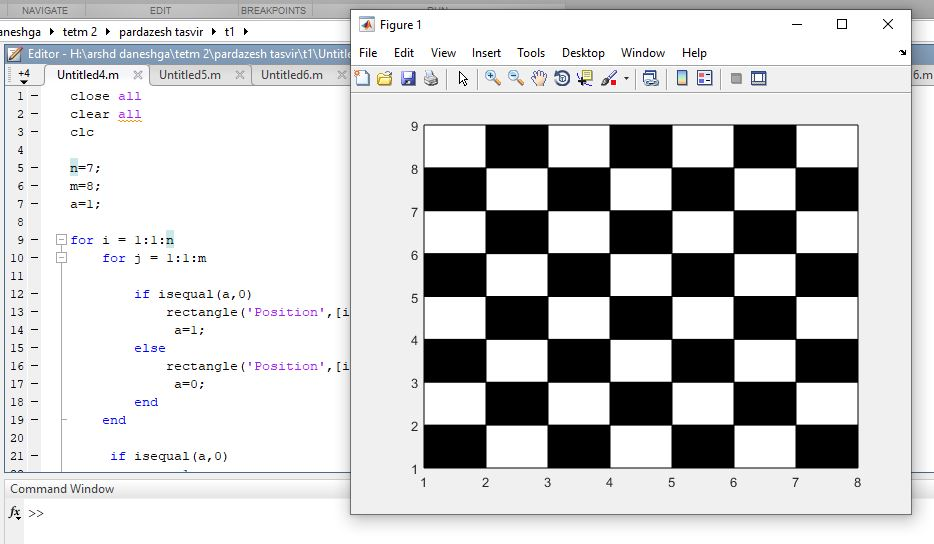

<div dir="rtl">

ابتدا تعداد سطر و ستون ها رامشخص می کنیم، که در این مثال 7 ستون و 8سطر داریم.<br/>
</div>

```
n=7;
m=8;
a=1;  
```


```
for i = 1:1:n
    for j = 1:1:m
        
        if isequal(a,0) 
            rectangle('Position',[i j 1 1], 'FaceColor', [1 1 1])
             a=1;
        else
            rectangle('Position',[i j 1 1], 'FaceColor',  [0 0 0])
             a=0;
        end
    end
     if isequal(a,0)
            a=1;
     else
            a=0;
     end
end
```


out=
