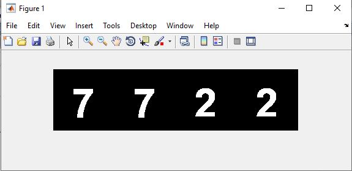

<div dir ="rtl">

###  تمرین 10:<br/>
</div>

<div dir ="rtl">

*    یک کپچای تصویری به اندازه 100*350 ایجاد می کنیم . <br/>

</div>

```
capcha=zeros(100,350);
```

```
for i=1:4
```
<div dir ="rtl">

*    اعداد را با تابع عدد تصادفی ایجادمی کنیم. <br/>

</div>


```
   rand=randi(10);
   cap=strcat('numbers\',int2str(rand),'.png');
   a=imread(cap);
   ```
   <div dir ="rtl">

*   سپس با توجه به اعداد بدست آمده برای هر یک در تصویر پیکسل های مورد نظر را رسم می کنیم  . <br/>

</div>
   
   ```
   for r=1:100
       for k=1:100
           c=(i-1)*100+k;
           capcha(r,c)=(255-a(r,k));
       end
   end    
end 
```
 <div dir ="rtl">

*   تصویر را به باینری تبدیل می کنیم.  <br/>
اعداد به رنگ سفید و پیش زمینه  به رنگ مشکی است. <br/>

</div>

```
figure;
capcha=im2bw(capcha);
imshow(capcha)
```

<div dir ="rtl">

*    خروجی به شکل زیر می باشد:<br/>
</div>

out=
out=
out=
