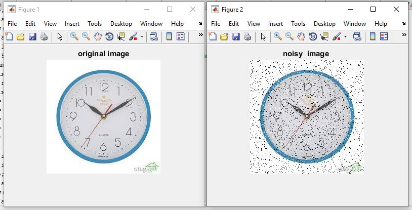
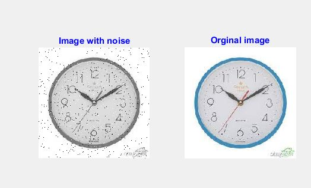

<div dir ="rtl">

تمرین 11:<br/>
* ابتدا تصویر را می خوانیم.<br/>

</div>

```

image=imread('saat.png');
img_with_noise=rgb2gray(image);
[m,n]=size(img_with_noise);

```


<div dir ="rtl">

 * حال به صورت رندوم ،نقاط نویز را ایجاد می کند.<br/>

</div>


```
%salt & pepper

x = randi([0 ,255] , m ,n);
img_with_noise(x<=0+2)=0;
img_with_noise(x>=255-2)=255;
```

<div dir ="rtl">


* نمایش  تصویر : <br/>

</div>


```
subplot(1,2,1); imshow(img_with_noise);title('Image with noise','Color','blue');
subplot(1,2,2);imshow(image);title('Orginal image','Color','blue');
````


<div dir ="rtl">

 * نمایش تصویر نویز فلفلی و تصویر اصلی:<br/>

</div>


out=

out1=


