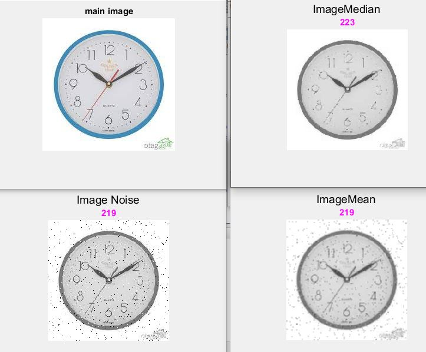

<div dir ="rtl"> 

### تمرین 12:

*  خواندن تصویر و تبدیل به تصویر خاکستری:<br/>

</div>


```
image=imread('saat.png');

 img_with_noise=rgb2gray(image);
 [m,n]=size(img_with_noise);
```

<div dir ="rtl">

* ایجاد نویز فلفل نمکی:<br/>

</div>
 

```
x = randi([0 ,255] , m ,n);
img_with_noise(x<=0+2)=0;
img_with_noise(x>=255-2)=255;
```

<div dir ="rtl">

* فیلتر میانگین:<br/>

</div>

```
image_size = size(img_with_noise);
sum = 0;
image_result1 = zeros(image_size(1, 1), image_size(1, 2));

for i = 1:image_size(1, 1)
   for j= 1:image_size(1, 2)
    image(i, j) = image(i, j);
   end
end

for i = 1:image_size(1, 1)
   for j= 1:image_size(1, 2)
       if(i == 1 && j == 1)
           sum = [ image(i, j) image(i, j+1) image(i+1, j) image(i+1, j+1)];
       elseif(i == image_size(1, 1) && j == 1)
           sum = [ image(i-1, j) image(i-1, j+1) image(i, j) image(i-1, j+1)];
       elseif(i == 1 && j == image_size(1, 2))
           sum = [ image(i, j-1) image(i, j) image(i+1, j-1) image(i+1, j)];
       elseif(i == image_size(1, 1) && j == image_size(1, 2))
           sum = [ image(i-1, j-1) image(i-1, j) image(i, j-1) image(i, j)];
       elseif(i == 1)
           sum = [ image(i, j-1) image(i, j) image(i, j+1) image(i+1, j-1) image(i+1, j) image(i+1, j+1)];
       elseif(i == image_size(1, 1))
           sum = [ image(i-1, j-1) image(i-1, j) image(i-1, j+1) image(i, j-1) image(i, j) image(i-1, j+1)];
       elseif(j == 1)
           sum = [ image(i-1, j) image(i-1, j+1) image(i, j) image(i-1, j+1) image(i+1, j) image(i+1, j+1)];
       elseif(j == image_size(1, 2))
           sum = [ image(i-1, j-1) image(i-1, j) image(i, j-1) image(i, j) image(i+1, j-1) image(i+1, j)];
       else
           sum = [ image(i-1, j-1) image(i-1, j) image(i-1, j+1) image(i, j-1) image(i, j) image(i-1, j+1) image(i+1, j-1) image(i+1, j) image(i+1, j+1)];
       end
       
       image_result1(i, j) = uint8(round(mean(sum)));
       sum = 0;
   end
end
```

<div dir ="rtl">

* فیلتر میانه:<br/>

</div>


```
image_size = size(img_with_noise);
sum = 0;
image_result= zeros(image_size(1, 1), image_size(1, 2));

for i = 1:image_size(1, 1)
   for j= 1:image_size(1, 2)
    image(i, j) = image(i, j);
   end
end

for i = 1:image_size(1, 1)
   for j= 1:image_size(1, 2)
       if(i == 1 && j == 1)
           sum = [ image(i, j) image(i, j+1) image(i+1, j) image(i+1, j+1)];
           sum = sort(sum);
           image_result(i, j) = uint8(sum(2));
       elseif(i == image_size(1, 1) && j == 1)
           sum = [ image(i-1, j) image(i-1, j+1) image(i, j) image(i-1, j+1)];
           sum = sort(sum);
           image_result(i, j) = uint8(sum(2));
       elseif(i == 1 && j == image_size(1, 2))
           sum = [ image(i, j-1) image(i, j) image(i+1, j-1) image(i+1, j)];
           sum = sort(sum);
           image_result(i, j) = uint8(sum(2));
       elseif(i == image_size(1, 1) && j == image_size(1, 2))
           sum = [ image(i-1, j-1) image(i-1, j) image(i, j-1) image(i, j)];
           sum = sort(sum);
           image_result(i, j) = uint8(sum(2));
       elseif(i == 1)
           sum = [ image(i, j-1) image(i, j) image(i, j+1) image(i+1, j-1) image(i+1, j) image(i+1, j+1)];
           sum = sort(sum);
           image_result(i, j) = uint8(sum(3));
       elseif(i == image_size(1, 1))
           sum = [ image(i-1, j-1) image(i-1, j) image(i-1, j+1) image(i, j-1) image(i, j) image(i-1, j+1)];
           sum = sort(sum);
           image_result(i, j) = uint8(sum(3));
       elseif(j == 1)
           sum = [ image(i-1, j) image(i-1, j+1) image(i, j) image(i-1, j+1) image(i+1, j) image(i+1, j+1)];
           sum = sort(sum);
           image_result(i, j) = uint8(sum(3));
       elseif(j == image_size(1, 2))
           sum = [ image(i-1, j-1) image(i-1, j) image(i, j-1) image(i, j) image(i+1, j-1) image(i+1, j)];
           sum = sort(sum);
           image_result(i, j) = uint8(sum(3));
       else
           sum = [ image(i-1, j-1) image(i-1, j) image(i-1, j+1) image(i, j-1) image(i, j) image(i-1, j+1) image(i+1, j-1) image(i+1, j) image(i+1, j+1)];
           sum = sort(sum);
           image_result(i, j) = uint8(sum(5));
       end
       
       %image_result(i, j) = uint8(round(mean(sum)));
       sum = 0;
   end
end
```


<div dir ="rtl">

 * به دست آوردن  میانگین های تصاویر :<br/>

</div>


```
mean_image = round(mean(mean(img_with_noise)));
mean_noise = round(mean(mean(img_with_noise)));
mean_avg = round(mean(mean(image_result1)));
mean_med = round(mean(mean(image_result)));
```

<div dir ="rtl">

 * خواندن خروجی ها :<br/>

</div>

```
display(mean_image);
display(mean_noise);
display(mean_avg);
display(mean_med);
```


<div dir ="rtl">

 * نمایش تصویر ها:<br/>

</div>


```
 figure;
 imshow(im);title(mean_noise);
 suptitle('main image ');
 
figure;
imshow( img_with_noise);
title(mean_noise,'Color','m');
suptitle('Image Noise ');


figure;
imshow(uint8(image_result1));
title(mean_avg,'Color','m');
suptitle('ImageMean ');

figure;
imshow(uint8(image_result));
title(mean_med,'Color','m');
suptitle('ImageMedian ');

```


out=
