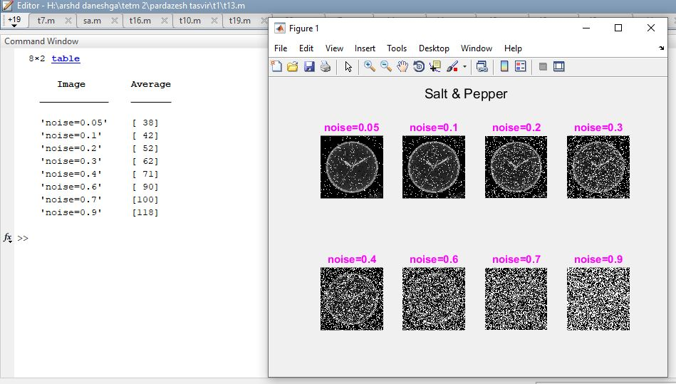

<div dir ="rtl">

###  تمرین 13:<br/>
</div>

<div dir ="rtl">

*  ابتدا تصویر را با این قطه کد  خاکستری کردیم.   <br/>

</div>


```
clc;
clear;
close all;

image = imread('saat.png');
im = rgb2gray(image);
```
<div dir ="rtl">

*   تصویر را با این قطه کد نگاتیو کردیم.   <br/>

</div>


```
[x, y] = size(im);


for i=1:x
    for j=1:y
       im(i,j) = 255 - im(i,j);
    end
end
```

<div dir ="rtl">

*  روی یک تصویر نگاتیو نویز فلفل نمکی را با اعداد مختلف تست کردیم و میانگین تمام پیکسل های آن را در یک جدول،مشخص کردیم.   <br/>

</div>


```
img_with_noise1= imnoise(im, 'salt & pepper', 0.05);
img_with_noise2 = imnoise(im, 'salt & pepper',0.1);
img_with_noise3 = imnoise(im, 'salt & pepper', .2);
img_with_noise4 = imnoise(im, 'salt & pepper', .3);
img_with_noise5 = imnoise(im, 'salt & pepper', .4);
img_with_noise6 = imnoise(im, 'salt & pepper', .6);
img_with_noise7 = imnoise(im, 'salt & pepper', .7);
img_with_noise8 = imnoise(im, 'salt & pepper', .9);

```

<div dir ="rtl">

*   محاسبات مربوط به میانگین پیکسل های هر تصویر(باتوجه به نویز داده شده):  <br/>

</div>

```
mean_noise1 = round(mean(mean(img_with_noise1)));
mean_noise2 = round(mean(mean(img_with_noise2)));
mean_noise3 = round(mean(mean(img_with_noise3)));
mean_noise4 = round(mean(mean(img_with_noise4)));
mean_noise5 = round(mean(mean(img_with_noise5)));
mean_noise6 = round(mean(mean(img_with_noise6)));
mean_noise7 = round(mean(mean(img_with_noise7)));
mean_noise8 = round(mean(mean(img_with_noise8)));
```

<div dir ="rtl">

*   نمایش مقادیر خروجی:  <br/>

</div>

```
display(mean_noise1);
display(mean_noise2);
display(mean_noise3);
display(mean_noise4);
display(mean_noise5);
display(mean_noise6);
display(mean_noise7);
display(mean_noise8);
```


<div dir ="rtl">

* این قطعه کد مربوطه به نمایش تصویر نگاتیو نویز فلفلی می باشد:  <br/>

</div>


```
 subplot(2,4,1);
 imshow(img_with_noise1);title('noise=0.05','Color','m');
 
 subplot(2,4,2);
 imshow(img_with_noise2);title('noise=0.1','Color','m');
 
 subplot(2,4,3);
 imshow(img_with_noise3);title('noise=0.2','Color','m');
 
 subplot(2,4,4);
 imshow(img_with_noise4);title('noise=0.3','Color','m');
 
 
 subplot(2,4,5);
 imshow(img_with_noise5);title('noise=0.4','Color','m');
 
 subplot(2,4,6);
 imshow(img_with_noise6);title('noise=0.6','Color','m');
 
 
 subplot(2,4,7);
 imshow(img_with_noise7);title('noise=0.7','Color','m');
 
 subplot(2,4,8);
 imshow(img_with_noise8);title('noise=0.9','Color','m');
 
 
 suptitle('Salt & Pepper ');

```
<div dir ="rtl">

*   کد مربوط به ایجاد جدول:  <br/>

</div>

```
Average ={mean_noise1; mean_noise2; mean_noise3; mean_noise4; mean_noise5; mean_noise6 ; mean_noise7;  mean_noise8 };
Image = {'noise=0.05';'noise=0.1';'noise=0.2';'noise=0.3' ;'noise=0.4';'noise=0.6';'noise=0.7';'noise=0.9'};
handles.T=table(Image ,Average);
display(handles.T);
```


<div dir ="rtl">

*   تصویر خروجی:  <br/>

</div>


out1=


<div dir ="rtl">

*   نمایش جدول :  <br/>

</div>


|     Image      | mean_noise(salt & pepper) | 
|     :---       |           :---:            |          
|   noise=0.05   |            38            | 
|   noise=0.1    |            42            | 
|   noise=0.2    |            52            | 
|   noise=0.3    |            62            | 
|   noise=0.4    |            71            | 
|   noise=0.6    |            90            | 
|   noise=0.7    |           100            | 
|   noise=0.9    |            118           | 
