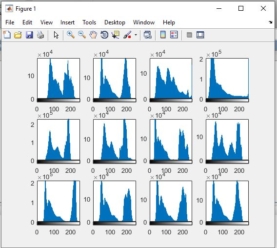

<div dir ="rtl">

###  تمرین 14:<br/>
</div>

<div dir ="rtl">

###   توضیح کد اول:
</div>


```
clc;
close all;
clear all;
```


<div dir ="rtl">

*    ابتدا تمام تصاویر رادر یک پوشه را می خوانیم. <br/>


</div>


```
pictures =dir('a/*.jpg');
```
<div dir ="rtl">


*    با یک حلقه تصاویر را می خوانیم و به تصویر خاکستری تبدیل می کنیم. <br/>


</div>


```
for k =1:9
        pic=pictures(k).name;
        image=imread(pic);
        image=rgb2gray(image);
        subplot(3,3,k)
        
   ```   
       
       
 <div dir ="rtl">
 
*   با این قطعه کد،هیستوگرام تصویر ها مشخص می شود. <br/>

</div>
 
          
  ```
          imhist(image);
         
  ```
       
       
  ```
  end

```

<div dir ="rtl">

*    هیستوگرام 9 تصویر به این صورت می باشد: <br/>

 
*  .همان طور که مشاهده می فرمایید;<br/> تصاویری که روشن تر (سفید تر) هستنتد،هیستوگرام بیش تر به سمت "سفید" است و  تصاویری که تیره ترند، هیستوگرام به سمت "سیاه " مایل است.


</div>


out=


<div dir ="rtl">

*   این خروجی ، مربوط به 12 تصویر در پوشه Test می باشد: <br/>

</div>


out=


