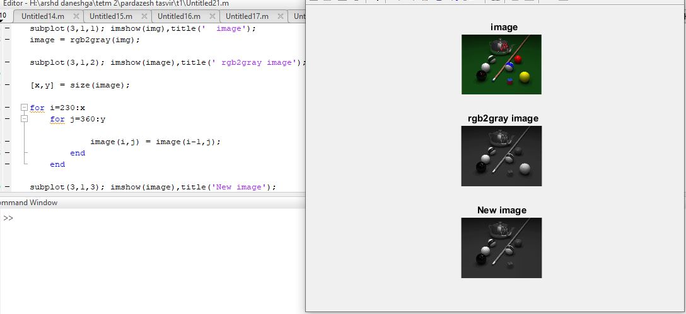

<div dir ="rtl">

 # تمرین15:<br/>
</div>


```
clc;
clear all;
close all;
```

<div dir ="rtl">

* عکس را می خوانیم و نمایش می دهیم.<br/>
</div>


```
img = imread('pool.png');
subplot(3,1,1); imshow(img),title('  image');
```

<div dir ="rtl">

 * تصویر را به تصویر خاکستری تبدیل می کنیم و نمایش می دهیم.<br/>
</div>

```
image = rgb2gray(img);
subplot(3,1,2); imshow(image),title(' rgb2gray image');
```

<div dir ="rtl">

 * سایز تصویر را در ماتریس قرار می دهیم .<br/>
</div>

```
[x,y] = size(image);
```


<div dir ="rtl">

 * سپس توپ زرد را از تصویر حذف می کنیم.<br/>
</div>

```
for i=230:x
    for j=360:y
       
            image(i,j) = image(i-1,j);
        end
    end

subplot(3,1,3); imshow(image),title('New image');
```

out=


