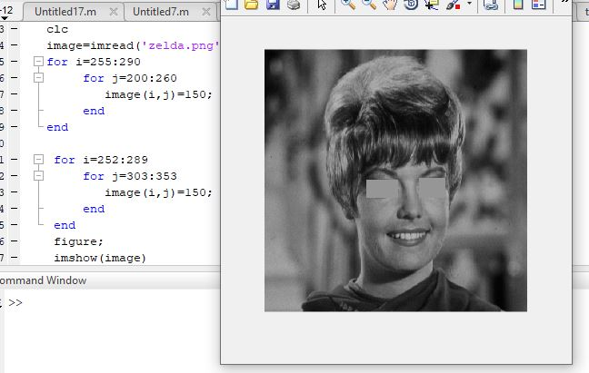

<div dir ="rtl">

###  تمرین 16:<br/>
</div>


```

close all
clear all
clc
```

<div dir ="rtl">

*   ابتدا با کد زیر،عکسzelda را می خوانیم.<br/>
</div>


```
image=imread('zelda.png');
```
 <div dir ="rtl">

*   با قطعه کد زیر ،پیکسل های مربوطه به چشم هایzelda را پیدا  و حذف می کنیم .<br/>
</div>
 

```
for i=255:290 
     for j=200:260
        image(i,j)=150;
     end
end

 for i=252:289 
     for j=303:353
        image(i,j)=150;
     end
 end
 ```
 <div dir ="rtl">

*   تصویر نهایی را نمایش می دهیم.<br/>
</div>
 
 
 ```
 figure;
 imshow(image)
 ```


### out=

