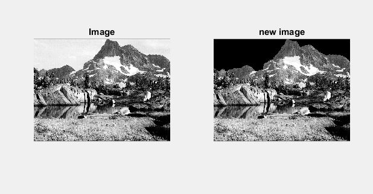

<div dir ="rtl">

###  تمرین 17:<br/>
</div>


<div dir ="rtl">

*   ابتدا عکس را می خوانیم.<br/>
</div>

```
image = imread('mountain.png');
subplot(1,2,1); imshow(image),title('Image');
```

<div dir ="rtl">

*   سایز تصویری را در یک ماتریسی ذخیره می کنیم.<br/>
</div>


```
[x,y] = size(image);
```
<div dir ="rtl">

*   حال باتوجه به پیکسل های مربوط به آسمان،رنگ آن راتغییر می دهیم .(سیاه می کنیم.).<br/>
</div>


```
for j=2:y 
    for i=2:150 
        if (image(i,j)<120)
           break
        end  
       if (image(i,j)>120)
            image(i,j)=0; 
        end  
    end 
end
img=uint8(image);
```

<div dir ="rtl">

*   تصویر نهایی را نمایش می دهیم.<br/>
</div>


```
subplot(1,2,2); imshow(img),title('new image');
```

### out =


```
