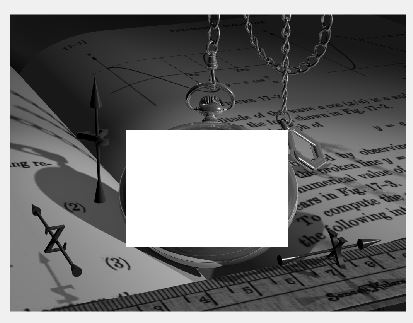

<div dir="rtl">

## تمرین 18    <br/>
</div>


```
close all
clear all
clc
```
<div dir ="rtl">
 
*   ابتدا تصویر را می خوانیم <br/>

</div>


```
image=imread('watch.png');
```


<div dir ="rtl">
 
*   سپس تصویر را خاکستری می کنیم و  با توجه به مختصات ( صفحه ی ساعت)، صفحه ی ساعت را سفید می کنیم. <br/>

</div>

```
im=rgb2gray(image);


 for i=300:600
     for j=300:720
        im(i,j)=255;
     end
 end
 ```

<div dir ="rtl">
 
*   نمایش خروجی: <br/>

</div>
 
 ```
 figure;
 imshow(im)
 ```  
 
 
 out:
 
