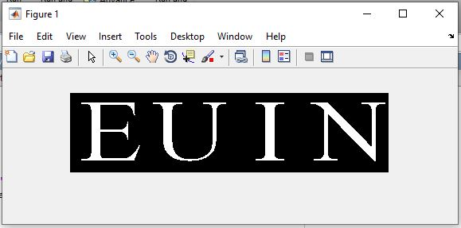
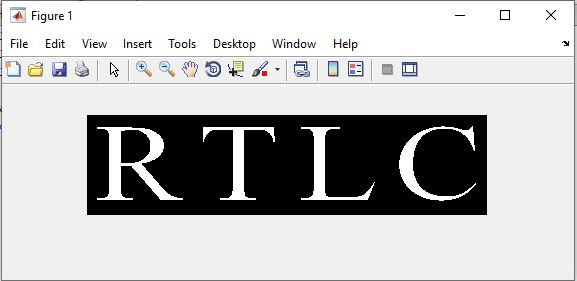

<div dir ="rtl">

###  تمرین 19:<br/>

  
*  این تمرین مشابه تمرین 10 است، فقط به جای اعداد از حروف باید استفاده کنیم. <br/>   
 
</div>


```
clc;
close all;
clear;
```

```
for i=1:4
    alphabetic=char(randi(+'AZ'));
    cap=strcat('alph\',alphabetic,'.png');
   a=imread(cap);
   
   for r=1:100
       for k=1:100
           c=(i-1)*100+k;
           capcha(r,c)=(255-a(r,k));
       end
   end    
end 
```

```
figure;
capcha=im2bw(capcha);
image_new=~capcha;
imshow(image_new)
```


<div dir ="rtl">


  
*  کپچا های تصادفی ایجاد شده ،به صورت زیر می باشد:<br/>   
 
</div>


out=

out=
