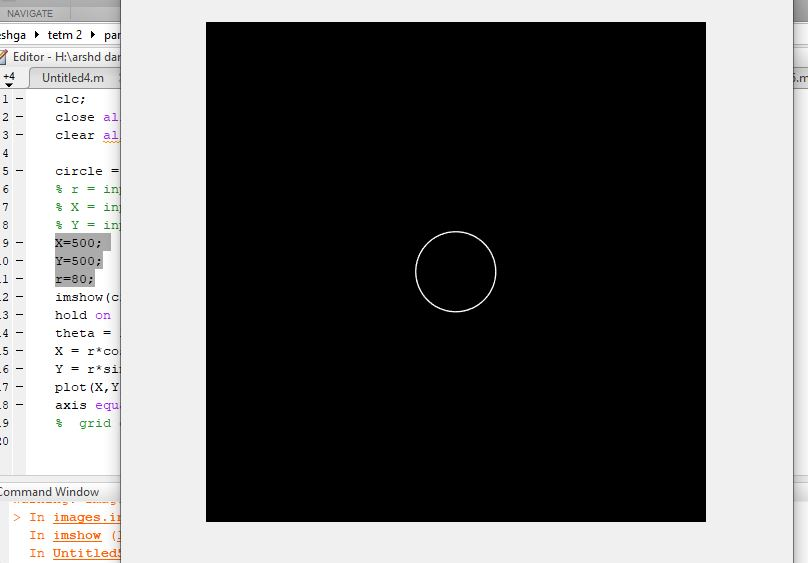
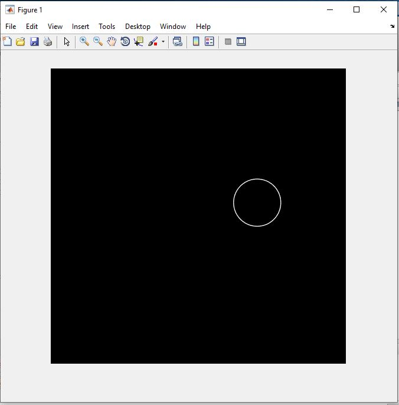

<div dir="rtl">
تمرین دوم:<br/>


ابتدا ماتریسی 1000*1000  ایجاد می کنیم.<br/>
</div>

```
circle = zeros(1000,1000);
```
```
% r = input(' Please Enter radius: ');
% X = input('Please Enter x : ');
% Y = input('Please Enter y : ');
```
<div dir="rtl">
x,y .
نقاط  رسم  دایره را مشخص می کنن و r ،شعاع دایره.
<br/>
</div>


```

X=500; 
Y=500;
r=80;
imshow(circle)
hold on
theta = linspace(0,2*pi);
X = r*cos(theta)+X;  
Y = r*sin(theta)+Y;
plot(X,Y,'w','LineWidth',1)
axis equal;


```

out1=


out2=

