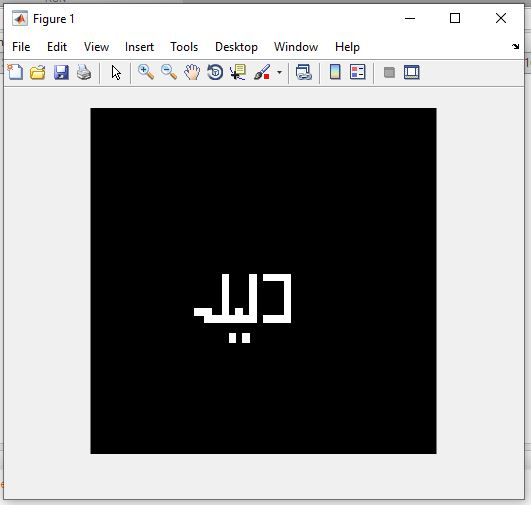

<div dir="rtl">
تمرین20:<br/>

ابتدا یک ماتریس1000* 1000ایجاد می کنیم.<br/>
</div>

```
image=zeros(1000,1000);
```

<div dir="rtl">
سپس، پیکسل های مربوطه را با کد های زیر سفید می کنیم.<br/>
</div>

```
image(600:620,500:580)=1;
 image(480:500,500:580)=1;
image(490:600,560:580)=1;
%l

 image(480:620,460:480)=1;
image(600:620,420:480)=1;

 image(580:620,420:440)=1;
 %
 image(600:620,400:420)=1;
 %
 
 image(480:620,380:400)=1;
 image(600:620,350:380)=1;
 image(580:620,330:350)=1;
 image(580:600,300:350)=1;
 
 %%noghte
 image(650:680,400:420)=1;
 image(650:680,440:460)=1;
```

<div dir="rtl">
سپس شکل را نمایش می دهیم.<br/>
</div>

```
imshow(image);
```
out:

