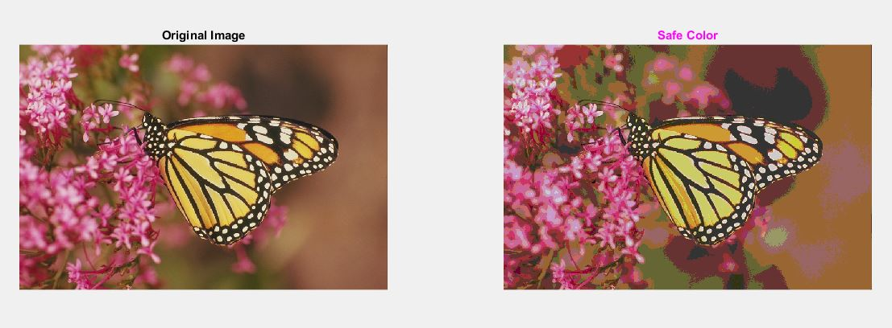

<div dir ="rtl">

###  تمرین 21:<br/>
</div>


```
clc;
close all;
clear;
```


<div dir ="rtl">
 
*   ابتدا تصویر را می خوانیم. <br/>

</div>

```
image=imread('monarch.png');
subplot(1,2,1);imshow(image);title('Original Image');

```


 <div dir ="rtl">
 
*   سایز تصویر را در داخل یک ماتریس ذخیره می کنیم. <br/>

</div>

```
[height,width,z]=size(image);

```
<div dir ="rtl">
 
*    این قطعه کد مربوط به  تبدیل  ,safe color است. <br/>

</div>


```
for i=1:height
    for j=1:width
        for k=1:z
            out(i,j,k)=floor(image(i,j,k)/51)*51;
        end
    end
end 
```

```
subplot(1,2,2); imshow(out);title('Safe Color','Color','m');

```


<div dir ="rtl">
 
*    نمایش خروجی: <br/>

</div>


out=
