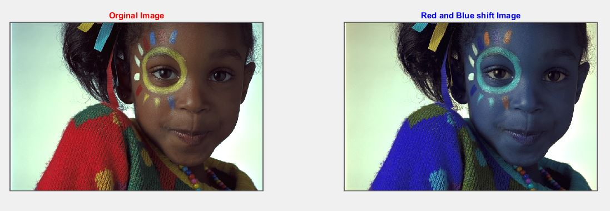

<div dir ="rtl">

###  تمرین 22:<br/>

 
*   ابتدا تصویر را می خوانیم <br/>

</div>


```
image=imread('girl.png');
```

```
one=image;
```

<div dir ="rtl">
 
*    سپس  دو کانال آبی و قرمز را جا به جا می کنیم. <br/>

</div>
```
red = image(:,:,1);
blue =image(:,:,3);
image(:,:,3)=red;
image(:,:,1)=blue;
```

```
im(:,:,3)=red;
im(:,:,1)=blue;
```

<div dir ="rtl">
 
*    این قطع کد ،برای نمایش خروجی است  <br/>

</div>

```
subplot(1,2,1);imshow(one);title('Orginal Image','Color','r');
subplot(1,2,2);imshow(image);title('Red and Blue shift Image','Color','b');
```


<div dir ="rtl">
 
*    نمایش خروجی: <br/>
همان طور که در تصویر مشاهده می کنید ، تمام قسمت هایی که در تصویر اصلی قرمز بوده است بعد از این تغییر ، به رنگ آبی تبدیل شده است و بر عکس.

</div>


out=
