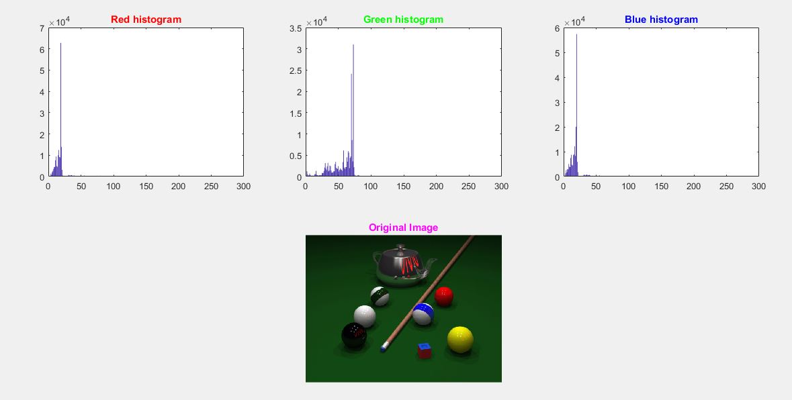

<div dir ="rtl">

###  تمرین 23:<br/>
### قسمت اول:<br/>
 
*   ابتدا تصویر را می خوانیم و درون متغیری قرار می دهیم(gray Image). <br/>

</div>


```
grayImage = imread('pool.png');
```


<div dir ="rtl">
 
*    این قطعه کد مربوط به تقسیم به کانالهای RGBاست.   <br/>

</div>

```

Red = grayImage(:,:,1);
Green = grayImage(:,:,2);
Blue = grayImage(:,:,3);
```


<div dir ="rtl">
 
*     در این قطعه کد با فراخوانی تابع هیستوگرام ،هیستوگرام هر کانال مشخص می شود   .   <br/>

</div>


```
im_histogram(Red);
subplot(2,3,1);bar(ans);title('Red histogram','Color','r');
im_histogram(Green);
subplot(2,3,2);bar(ans);title('Green histogram','Color','g');
im_histogram(Blue);
subplot(2,3,3);bar(ans);title('Blue histogram','Color','b');
subplot(2,3,5);imshow(grayImage);title('Original Image','Color','m')
```


<div dir ="rtl">
 
*    نمایش خروجی: <br/>

</div>


out=


<div dir ="rtl">

###  قسمت دوم:<br/>
 
*    این کد هم مربوط به تابع هیستوگرام است.   <br/>
</div>


```
function [counts, grayLevels] = im_histogram(grayImage)
[rows, columns, numberOfColorChannels] = size(grayImage);
counts = zeros(1, 256);
for col = 1 : columns
	for row = 1 : rows
		% Get the gray level.
		grayLevel = grayImage(row, col);
		% Add 1 because graylevel zero goes into index 1 and so on.
		counts(grayLevel+ 1) = counts(grayLevel+1) + 1;
	end
end
```


