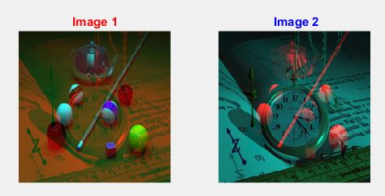

<div dir ="rtl">
 
*    ابتدا دو تصویر را می خوانیم و چون سایز این دوعکس متفاوت است، تغییر سایز می دهیم و سپس   کانال های قرمز را در متغیری ذخیره می کنیم. <br/>

</div>

```
image=imread('pool.png');
image=imresize(image,[200,200]);
red = image(:,:,1);

%%%  image2 %%

image2=imread('watch.png');
image2=imresize(image2,[200,200]);
red2 = image2(:,:,1);
```

<div dir ="rtl">

*   دو کانال قرمز باهم جا به جا می شوند.  <br/>
</div>

```
image2(:,:,1)=red;
image(:,:,1)=red2;

```


<div dir ="rtl">

*   این قطعه کد برای نمایش خروجی است.  <br/>
</div>


```
subplot(1,2,1);imshow(image);title('Image 1','Color','r');
subplot(1,2,2);imshow(image2);title(' Image 2','Color','b');
```


<div dir ="rtl">

*   نمایش خروجی:  <br/>
</div>


out=


