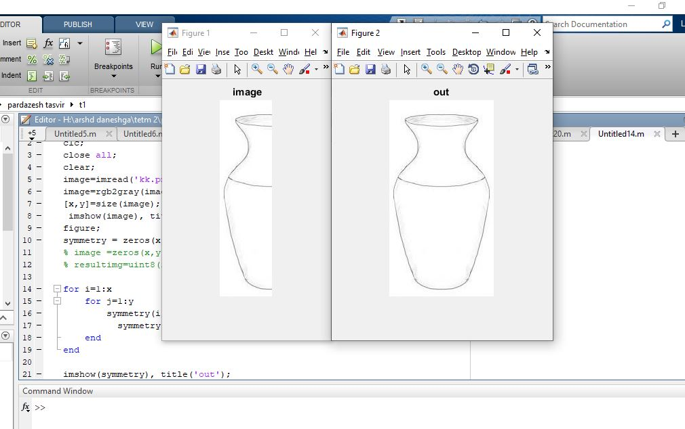
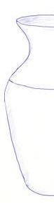

<div dir="rtl">


ابتدا تصویر را می خوانیم.<br/>
</div>

```
image=imread('kk.png');
```
<div dir="rtl">
تصویررا به خاکستری تبدیل می کنیم. <br/> 
</div>

```
image=rgb2gray(image);
```

<div dir="rtl">
سایز تصویر را در  یک ماتریس xو yقرار می دهیم.<br/>

</div>

```
[x,y]=size(image);
 imshow(image), title(' image');
figure;
```

```
symmetry = zeros(x, y*2,'uint8');
% image =zeros(x,y*2);
% resultimg=uint8(image);
```
<div dir="rtl">

تصویر را قرینه می کنیم.<br/>
</div>

```
for i=1:x
    for j=1:y
        symmetry(i,j) = image(i,j);
          symmetry(i,y+j)=image(i,y-j+1);
    end
end
```


```
imshow(symmetry), title('out');


```

<div dir="rtl">

تصویر خروجی را نمایش می دهیم.<br/>
</div>


out=
input=


