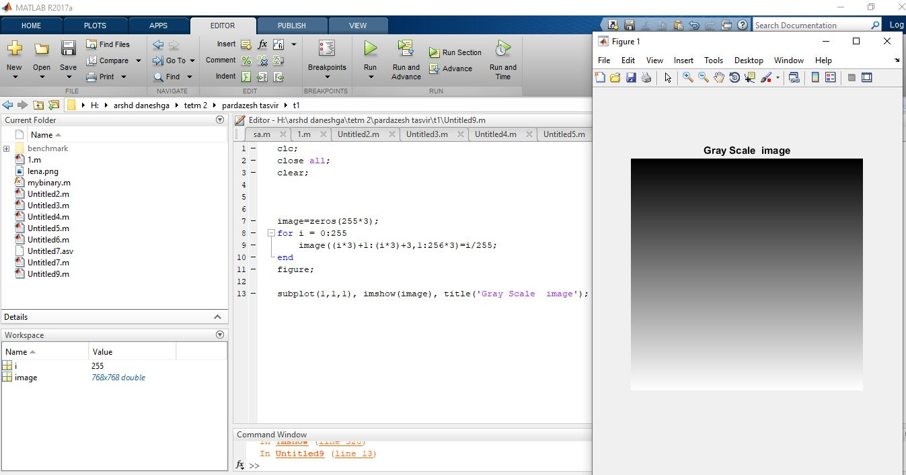

<div dir="rtl">
تمرین 6:<br/>
 </div>
```
clc;
close all;
clear;
```

```
image=zeros(255*3);
for i = 0:255
    image((i*3)+1:(i*3)+3,1:256*3)=i/255;
end
 imshow(image), title('Gray Scale  image');
 ```
 
 out=

