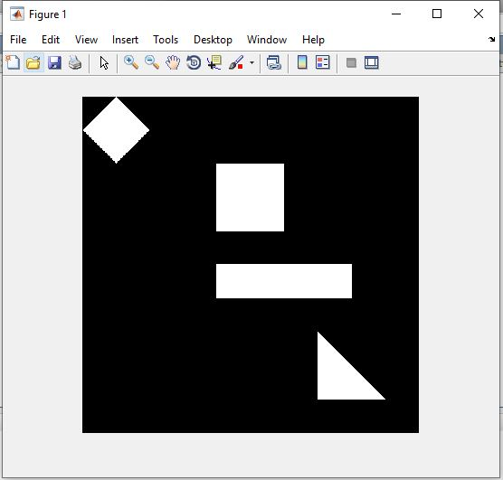

<div dir="rtl">
  
  ###   تمرین 7:</br>
* صویر 500 *500 درنظر گرفته شده است.</br>
</div>

```
image=zeros(500,500);
```
 
<div dir="rtl">
  
 * برای رسم مربع، این کد را می نویسیم.</br>
</div>


```
image(100:200,200:300)=1;
```

<div dir="rtl">
  
 * برای رسم مستطیل  این کد را می نویسیم.</br>
</div>


```
image(250:300,200:400)=1;
```

<div dir="rtl">
  
 * برای رسم مثلث  این کد را می نویسیم.</br>
</div>


```
for i=350:1:450
     
    for j=350:i
        image(i,j)=155;
    end
      
end
```

<div dir="rtl">
  
 * برای رسم لوزی  این کد را می نویسیم.</br>
</div>


``` 
for i=1:50
     for j=1:2*100+1
         if (j>=50-i+2 && j<=50+i)
            image(i,j)=255;
         end
     end
 end
 
for i=1:50
    for j=1:100
        if image(i,j)==255
            t=50-i;
            s=50+t;
            image(s,j)=255;
            
        end
       
    end
end
```


<div dir="rtl">
  
 * برای رسم شکل، این کد را می نویسیم:</br>
</div>

```
imshow(image);
```


</div>

