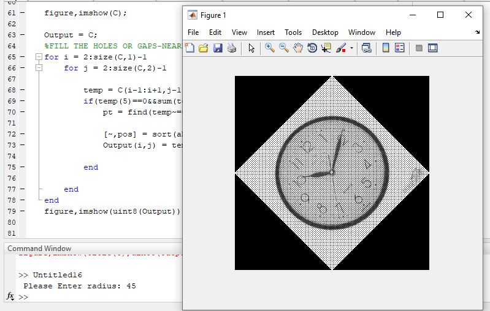

<div dir ="rtl">

###  تمرین 8:<br/>

* کد اول  ،هر کدام از زوایای خواسته شده را دوران می دهد. کد دوم هر زوایه ی دلخواهی که به ان بدهیم،شکل را دوران می دهد . <br/>

</div>

###  توضیح کد دوم:<br/>

<div dir ="rtl">

*   ابتدا با کد زیر،عکس را می خوانیم.<br/>
</div>

```
A = imread('saat.png');
```

```

%Specify the degree
%deg = 35;
deg = input(' Please Enter radius: ');


%Find the midpoint
if(deg > 155)
    midx = ceil((size(A,1))/2);
    midy = ceil((size(A,2))/2);
else
    midx = ceil((size(A,2))/2);
    midy = ceil((size(A,1))/2);
end

[y,x] = meshgrid(1:size(A,2), 1:size(A,1));
[t,r] = cart2pol(x-midx,y-midy);
t1 = radtodeg(t)+deg;

%Convert from degree to radians
t = degtorad(t1);

%Convert to Cartesian Co-ordinates
[x,y] = pol2cart(t,r);

%Add the mid points to the new co-ordinates
tempx = round(x+midx);
tempy = round(y+midy);

if ( min(tempx(:)) < 0 )
   
newx = max(tempx(:))+abs(min(tempx(:)))+1;
tempx = tempx+abs(min(tempx(:)))+1;
else
    newx = max(tempx(:));
end

if( min(tempy( : )) < 0 )
   
newy = max(tempy(:))+abs(min(tempy(:)))+1;
tempy = tempy+abs(min(tempy(:)))+1;
else
    newy = max(tempy(:));
end
tempy(tempy==0) = 1;
tempx(tempx==0) = 1;

C = uint8(zeros([newx newy]));


for i = 1:size(A,1)
    for j = 1:size(A,2)
        C(tempx(i,j),tempy(i,j)) = A(i,j);
       
    end
  
end

figure,imshow(C);

Output = C;
%FILL THE HOLES OR GAPS-NEAREST NEIGHBOR
for i = 2:size(C,1)-1
    for j = 2:size(C,2)-1
       
        temp = C(i-1:i+1,j-1:j+1);
        if(temp(5)==0&&sum(temp(:))~=0)
            pt = find(temp~=0);
           
            [~,pos] = sort(abs(pt-5));
            Output(i,j) = temp(pt(pos(1)));
          
        end
       
    end
end
figure,imshow(uint8(Output));

```


45 darage=


90 darage.JPG=


120 darage.JPG=


180 darage.JPG=


