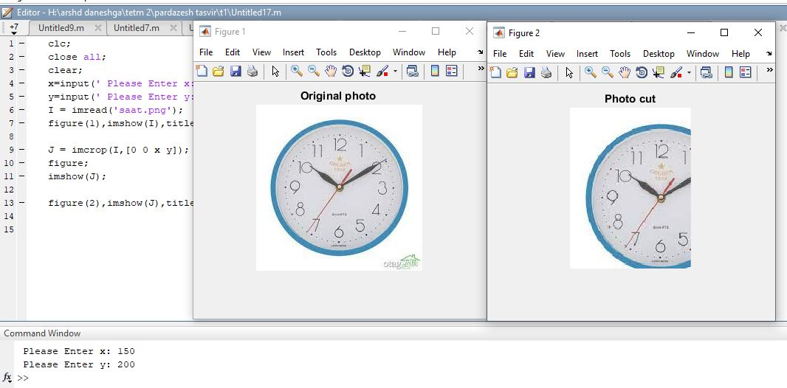

<div dir ="rtl">

تمرین 9:<br/>

</div>

```
clc;
close all;
clear;
```
<div dir ="rtl">
ابتدا با این قطه کد ، xوy که طول و عرض تصویر می باشد را از کاربر می گیریم.<br/>
</div>

```
x=input(' Please Enter x: ');
y=input(' Please Enter y: ');
```
<div dir ="rtl">
سپس تصویر رامی خوانیم.<br/>
</div>

```
I = imread('saat.png');
```

```
figure(1),imshow(I),title('Original photo ');

```

<div dir ="rtl">
با استفاده از تابع imcrop،تصویر را برش می دهد.باتوجه به طول وعرض داده شده .<br/>
</div>

```
J = imcrop(I,[0 0 x y]);
```
<div dir ="rtl">
حال تصویر نهایی را نشان می دهیم.<br/>
</div>

```
figure;
imshow(J);
```
```

figure(2),imshow(J),title('Photo cut');
```

out=
