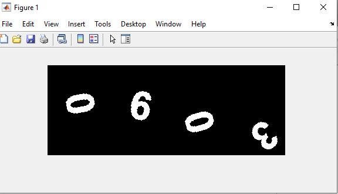

<div dir="rtl">
 
#### تمرین 10
#### بدون استفاده از دستوران متلب یک کپچای تصویری را بکشید؛ اعداد را با تابع عدد تصادفی ایجاد کنید و سپس با توجه به اعداد بدست آمده برای هر یک در تصویر پیکسل های مورد نظر را رسم کنید؛ تصویر باینری باشد و اعداد رنگ سفید و پیش زمینه رنگ مشکی داشته باشد. <br />

***

### توضیحات بخش های برنامه
***
 ###کد برنامه: <br />

</div>

```matlab
   
close all
clear all
clc
img=zeros(100,400);
for i=1:4
   r1=randi(10);
   r2=randi(100);
   pic="picture\number\"+int2str(r1-1)+".png";
   a=imread(pic);
   g=randi(30);
   r1=randi(360);
   b=captcha_rotate(a,r1);
   
   for r=r2+1:r2+100
       for k=g:100+g
           c=(i-1)*100+k;
           img(r,c)=(b(r-r2,k));
       end
   end    
end 
figure;
img=im2bw(img);
imshow(img)

```
***
<div dir="rtl">
###در این قسمت ابتدا تصویر خامی به ابعاد 100 در 400 ايجاد مي كند سپس توسط يك حلقه تكراراعداد تصادفي 4 عدد تصادفي توليد كرده و از روي شمارنده حلقه آدرس آن تصوير ايجاد مي گردد سپس آن تصوير خوانده شده و به اندازه 0 تا 360 درجه به صورت رندم دوران داده مي شود  <br />
 
 </div>
 
 ```matlab                                         
img=zeros(100,400);
for i=1:4
   r1=randi(10);
   r2=randi(100);
   pic="picture\number\"+int2str(r1-1)+".png";
   a=imread(pic);
   g=randi(30);
   r1=randi(360);
   b=captcha_rotate(a,r1);
   
   for r=r2+1:r2+100
       for k=g:100+g
           c=(i-1)*100+k;
           img(r,c)=(b(r-r2,k));
       end
   end    
end 
figure
img=im2bw(img);
imshow(img)                    
```
***
<div dir="rtl">
###تابعی که برای چرخش اعداد استفاده شده است در ذیل آورده شده که همان تابع تمرین شماره 8 است که بخشی از قسمت های آن حذف گردیده است
 در بخش اول پس از تعریف تابع ابعاد تصویر را محاسبه ورودی را بدست آورده و با استفاده از روابط مثلثاتی ابعاد تصویر جدید بعد از دوران را محاسبه می کند همچنین با توجه   <br />به اینکه تصویر حول مرکز دوران می کند مختصات نقطه وسط تصویر را نیز بدست می آورد
 
 </div>
 

***
