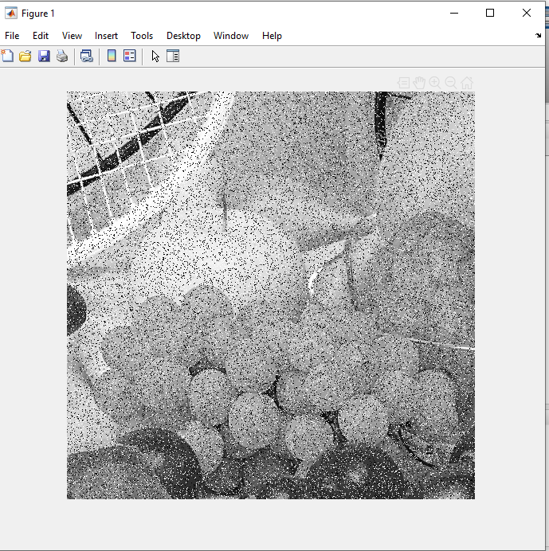

<div dir="rtl">
#### تمرین 11
#### بدون استفاده از دستورهای آماده ی متلب نویز فلفل نمکی را روی چند تصویر ایجاد کنید. <br />


###### کدبرنامه:
</div>

```matlab
clc;
clear all;
close all;
image=rgb2gray(imread("d:/image-processing-class/benchmark/fruits.png"));
 
for i=1:50000
    a=randi([1,size(image,1)]);
    b=randi([1,size(image,2)]);
    image(a,b)=randi([0,1])*255;
end
imshow(image);
```

<div dir="rtl">

#### برسی کد:

1.
- تصویر گربه در شاخه بنچ مارک خواندخ شدخ و توسط دستور rgb2gray بصورت خاکستری در متغییر img قرار میگیرد.
  
</div>

```matlab
image=rgb2gray(imread("d:/image-processing-class/benchmark/fruits.png"));
```
<div dir="rtl">

2.
- در حلقه for زیر به تعداد 30000 عدد تصادفی نقاط تصویر انتخاب شده و به رنگ سفید یا سیاه که ان هم تصادفی است در می آیند.
</div>

```matlab
for i=1:50000
    a=randi([1,size(image,1)]);
    b=randi([1,size(image,2)]);
    image(a,b)=randi([0,1])*255;
end
```

<div dir="rtl">

3.
- در نهایت تصویر حاصله که در ماتریس img قرار دارد توسط دستور imshow نمایش داده می شود.
</div>

```matlab
imshow(image);
```


