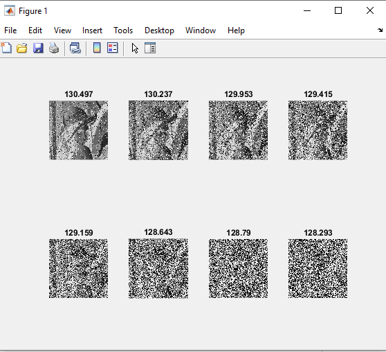

<div dir="rtl">
####تمرین 11 <br />
#### با کمک برنامه ی تمرین قبل برنامه ای بنویسید که مقدار تمام پیکسل های خروجی از فیلتر میانه، فیلتر میانگین، نویز فلفل نمکی را با یک عدد صحیح محاسبه کند. <br />


###### کد:
</div>

```matlab
clc;
clear all;
close all;
image=rgb2gray(imread("d:/image-processing-class/benchmark/fruits.png"));
[a, b] = size(image);
 subplot(2,2,1),imshow(image),title("orginal");
for i=1:30000
    X=randi([1,a]);
    Y=randi([1,b]);
    image(X,Y)=randi([0,1])*255;
end
subplot(2,2,2),imshow(image),title("noise image");
x = im2double(image);
k = [];
for i=2:a-1
    for j=2:b-1
            k(1) = x(i-1,j-1);
            k(2) = x(i-1,j) ;
            k(3) = x(i-1,j+1);
            k(4) = x(i,j-1);
            k(5) = x(i,j+1);
            k(6) = x(i+1, j-1);
            k(7) = x(i+1,j);
            k(8) = x(i+1,j+1);
            x(i,j) = median(k);
    end
end 
subplot(2,2,3),imshow(x),title("avrage noise");
y = im2double(image);
for i=2:a-1
    for j=2:b-1
            k(1) = y(i-1,j-1);
            k(2) = y(i-1,j) ;
            k(3) = y(i-1,j+1);
            k(4) = y(i,j-1);
            k(5) = y(i,j+1);
            k(6) = y(i+1, j-1);
            k(7) = y(i+1,j);
            k(8) = y(i+1,j+1);
            y(i,j) = mean(k);
    end
end 
subplot(2,2,4),imshow(y),title("middle noise ");

```

<div dir="rtl">

#### برسی کد:

1.
- خط اول قرار دادن تصویر میوه ها از پوشه بنچ مارک بصورت خاکستری در ماتریس image .
- نمایش تصویر.
</div>

```matlab
image=rgb2gray(imread("d:/image-processing-class/benchmark/fruits.png"));
[a, b] = size(image);
 subplot(2,2,1),imshow(image),title("orginal");
```
<div dir="rtl">

2.
- حلقه for با انتخاب تصادفی 100000 مختصات نقاط تصویر آنها را به رنگ سیاه و سفید در می آورد و کل تصویر را دچار نویز شدید فلفل نمکی می کند.<br />
</div>

```matlab
for i=1:30000
    X=randi([1,a]);
    Y=randi([1,b]);
    image(X,Y)=randi([0,1])*255;
end
```

<div dir="rtl">


3.
- یک گپی از تصویر را در ماتریس A قرار می دهد.
- یک آرایه بنام k جهت قرار گیری محاسبات همسایگی تعریف میکند.
</div>

```matlab
x = im2double(image);
k = [];

```
<div dir="rtl">

3.
- حلقه for خارجی کل پیکسلهای تصویر را بجز یک ردیف حاشیه عکس را پیمایش می کند.
- حلقه for داخلی   و خارجی مقادیر همسایه پیکسل پیمایش شده را داخل آریه k  قرار می دهد و میانه آنها را برای پیکسل جاری قرار می دهد.
- تصویر نهایی را نمایش میدهد.
</div>

```matlab
%Median filter 
k = [];
for i=2:a-1
    for j=2:b-1
            k(1) = x(i-1,j-1);
            k(2) = x(i-1,j) ;
            k(3) = x(i-1,j+1);
            k(4) = x(i,j-1);
            k(5) = x(i,j+1);
            k(6) = x(i+1, j-1);
            k(7) = x(i+1,j);
            k(8) = x(i+1,j+1);
            x(i,j) = median(k);
    end
end 
subplot(2,2,3),imshow(x),title("avrage noise");
for i=2:a-1
    for j=2:b-1
            k(1) = y(i-1,j-1);
            k(2) = y(i-1,j) ;
            k(3) = y(i-1,j+1);
            k(4) = y(i,j-1);
            k(5) = y(i,j+1);
            k(6) = y(i+1, j-1);
            k(7) = y(i+1,j);
            k(8) = y(i+1,j+1);
            y(i,j) = mean(k);
    end
end 
subplot(2,2,4),imshow(y),title("middle noise ");
```


