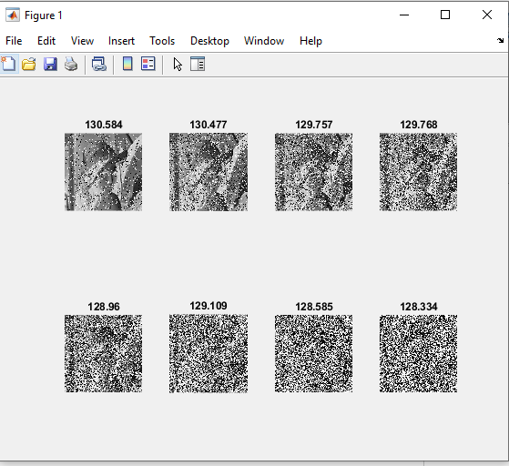

<div dir='rtl'>
    
## روی یک تصویر نگاتیو نویز فلفل نمکی را با اعداد مختلف امتحان کنید و میانگین تمام پیکسل های آن را در یک جدول خروجی دهید.:تمرین 13  </br>
## کد برنامه:  </br>
</div>
```matlab
clc;
clear all;
close all;
image = imread('../../../benchmark/lena.png');
imgray=rgb2gray(image);
[x,y] = size(imgray);

for i=1:x
    for j=1:y
        imgray(i,j) = 255 - imgray(i,j);
    end
end
s=1;
for i=.1:.1:.8
   image2 = imnoise(imgray,"salt & pepper",i);
   avg = mean(image2(:));
   subplot(2,4,s);
   imshow(image2);
   title(avg);
   s=s+1;
end

```
<div dir='rtl'>
  تصویر را خوانده و سایز تصویر را در متغیر های x و y  ذخیره میکنیم
</div>
</br>

```matlab
image = imread('../../../benchmark/lena.png');
imgray=rgb2gray(image);
[x,y] = size(imgray);
```

<div dir='rtl'>
  سپس با دستورهای for تصویر را به تصویر نگاتیو تبدیل میکنیم
</div>
</br>

```
for i=1:x
    for j=1:y
        imgray(i,j) = 255 - imgray(i,j);
    end
end

```

<div dir='rtl'>
  در پایان هم برای 8 مقدار جداگانه نویز را ایجاد کرده و سپس میانگین تمام پیکسل ها را محاسبه میکنیم و همه ی آنها را با کمک subplot در یکجا نمایش میدهیم و عنوان هر نمودار هم برابر با میانگین تمام پیکسل های آن است
</div>
</br>

```matlab
s=1;
for i=.1:.1:.8
   image2 = imnoise(imgray,"salt & pepper",i);
   avg = mean(image2(:));
   subplot(2,4,s);
   imshow(image2);
   title(avg);
   s=s+1;
end

```


