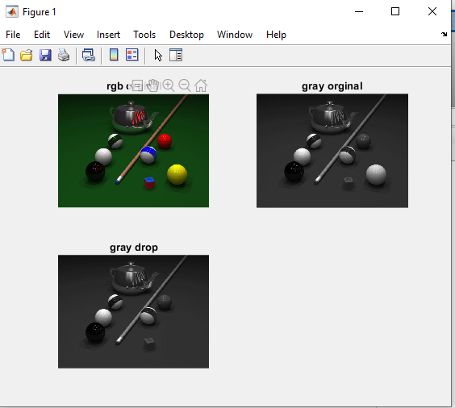

<div dir="rtl">

#### ابتدا تصویر pool.png را به grayscale تبدیل کنید و سپس توپ زرد را از تصویر حذف کنید.

###### کد:
</div>

```matlab
clc;
clear all;
close all;
image = imread("D:/image-processing-class/benchmark/pool.PNG");
subplot(2,2,1),imshow(image),title('rgb orginal');
gray = rgb2gray(image);
subplot(2,2,2),imshow(gray),title('gray orginal');

for i=230:350
    for j=350:470
        gray(i,j)=gray(i-1,j);
    end
end
gray=uint8(gray);
subplot(2,2,3),imshow(gray),title('gray drop');
```

<div dir="rtl">

#### برسی کد:

1.
- ابتدا تصویر pool را از پوشه بنچ مارک می خوانیم و ابتدا آن را چاپ می کنیم

</div>

```matlab
image = imread("D:/image-processing-class/benchmark/pool.PNG");
subplot(2,2,1),imshow(image),title('rgb orginal');
```
<div dir="rtl">

2.
- تصویر رنگی را تبدیل به تصویر خاکستری می کنیم و سپس آن را نمایش می دهیم
</div>

```matlab
gray = rgb2gray(image);
subplot(2,2,2),imshow(gray),title('gray orginal');
```

<div dir="rtl">

3.
- به کمک حلقه ی forبه  مقادیر پیکسل های مجاورغییر می کند مقادیر تمام پیکسل هایی که در شرط حلقه صدق میکنند مقادیر همسایه های آن یکسان می کنیم و به این ترتیب تصویر توپ زرد  ت
</div>

```matlab
for i=230:350
    for j=350:470
        gray(i,j)=gray(i-1,j);
    end
end
gray=uint8(gray);
subplot(2,2,3),imshow(gray),title('gray drop');
```


