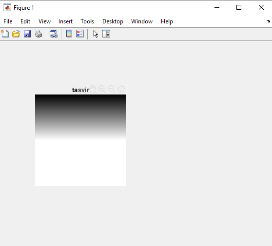

<div dir="rtl">

#### تمرین 6
#### یک تصویر راه راه بسازید که از سمت بالا سیاه کامل و پایین آن سفید باشد.    <br />
### کد:
</div>

```matlab
clc;
close all;
clear all;
image=zeros(600,'uint8');
for i = 1:256
    image((i*2)+3:(i*4)+5,1:256*4)=i;
end
subplot(1,2,1),imshow(image),title('tasvir');
```
---
<div dir="rtl">

#### lمراحل برنامه :

1.
-  یک تصویر خاکستری را با ماتریسی با درآیه های صفر ایجاد می کند <br />
</div>

```matlab
image=zeros(600,'uint8');
```
---
<div dir="rtl">

2.
-  با افزایش متغیر حلقه هر سه ردیف پیکسل یک شماره روشنتر می شود.<br />
</div>

```matlab
for i = 0:255
    image((i*2)+3:(i*4)+5,1:256*4)=i;
end
```
---
<div dir="rtl">
تصویر خروجی:<br />
</div>


