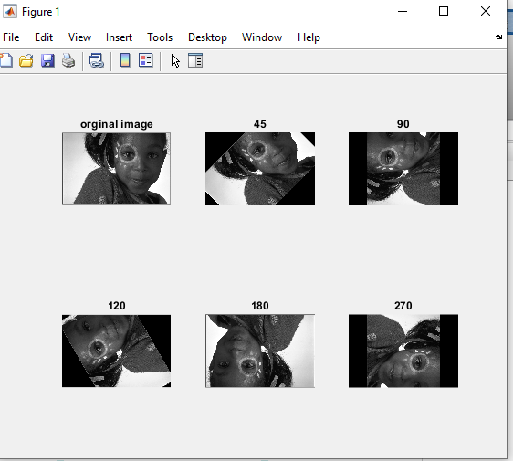

<div dir="rtl">

#### تمرین 8
#### بدون استفاده از توابع آماده ی متلب یک تصویر را با 45،90،120،180 درجه بچرخانید؛ در تصاویری که چرخش تصویر باعث خارج شدن از حالت مربعی می شود پیکسل های خالی را برابر رنگ مشکی قرار دهید و پیکسل های خارج شده از محدوده را نادیده بگیرید..    <br />
### کد:
</div>

```matlab
clc;
clear all;
close all;
img=imread('D:/image-processing-class/benchmark/girl.png');
imgry=rgb2gray(img);
imgro=zeros(size(imgry),'uint8');
cx=ceil((size(imgry,1)+1)/2);
cy=ceil((size(imgry,2)+1)/2);
zavia=[45,90,120,180,270];
l=length(zavia);
m=1;
subplot(2,(l+1)/2,1),imshow(imgry),title('orginal image');
while (m <= l)
    imgro=zeros(size(imgry),'uint8');
    p=(pi/180)*zavia(m);
    for i=1:size(imgro,1)
        for j=1:size(imgro,2)

            a= (i-cx)*cos(p)+(j-cy)*sin(p);
             b=-(i-cx)*sin(p)+(j-cy)*cos(p);
             a=round(a)+cx;
             b=round(b)+cy;

             if (a>=1 && b>=1 && a<=size(imgry,1) && b<=size(imgry,2))
                  imgro(i,j)=imgry(a,b);        
             end

        end
    end
    subplot(2,(l+1)/2,m+1),imshow(imgro),title(int2str(zavia(m)));
    
    m=m+1;
end
```
---
<div dir="rtl">
و تبدیل آن به تصویر خاکستری benchmark خواندن یک تصویر از تصاویر پوشه 
</div>    

```
img=imread('D:/image-processing-class/benchmark/girl.png');
imgry=rgb2gray(img);
```
<div dir="rtl">
ایجاد تصویر خاکستری با ایجاد ماتریس با درایه های صفرو مشخص کردن ابعاد تصویرو زاویه ها  
</div> 

```
imgry=rgb2gray(img);
imgro=zeros(size(imgry),'uint8');
cx=ceil((size(imgry,1)+1)/2);
cy=ceil((size(imgry,2)+1)/2);
zavia=[45,90,120,180,270];

```
<div dir="rtl">
    ایجاد مختصات و چاپ تصویر اصلی
</div> 

```
subplot(2,(l+1)/2,1),imshow(imgry),title('orginal image');
```
<div dir="rtl">
  وچرخاندن تصویر مورد نظر در زاویه های مختلف که این امر موجب خارج شدن از حالت مربعی می شود و پیکسل های خالی را برابر رنگ مشکی قرار می دهد و چاپ تصاویر در مختصات مختلف ماتریس و در زوایای مختلف
</div> 

```
while (m <= l)
    imgro=zeros(size(imgry),'uint8');
    p=(pi/180)*zavia(m);
    for i=1:size(imgro,1)
        for j=1:size(imgro,2)

            a= (i-cx)*cos(p)+(j-cy)*sin(p);
             b=-(i-cx)*sin(p)+(j-cy)*cos(p);
             a=round(a)+cx;
             b=round(b)+cy;

             if (a>=1 && b>=1 && a<=size(imgry,1) && b<=size(imgry,2))
                  imgro(i,j)=imgry(a,b);        
             end

        end
    end
    subplot(2,(l+1)/2,m+1),imshow(imgro),title(int2str(zavia(m)));
    
    m=m+1;
end
```

