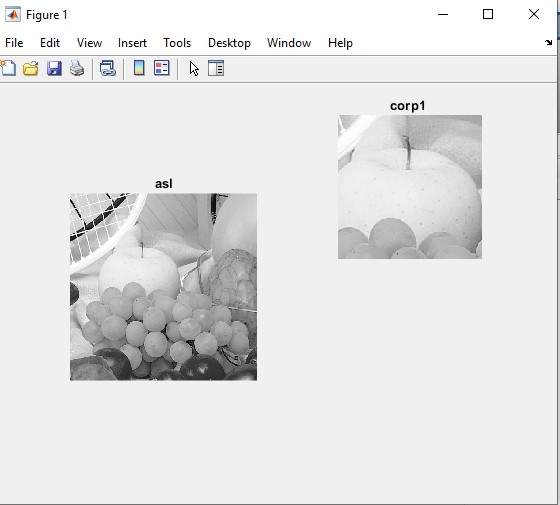

<div dir="rtl">

#### تمرین 9
####  برنامه ای بنویسید که یک طول و عرض را مشخص کرده و سپس یک تصویر را crop کند.<br />


### کد:
</div>

```matlab
clc;
clear all;
close all;
r1=100;r2=300;c1=100;c2=300;
image=rgb2gray(imread("d:/image-processing-class/benchmark/fruits.png"));
subplot(1,2,1),imshow(image),title('asl');
row=(r2-r1);
col=((c2-c1));
crop=zeros(row,col,'uint8');

for i = 1:row
    for j = 1:col
        crop(i,j)=image((r1+i),(c1+j));
    end
end
subplot(2,2,2),imshow(crop),title('corp1 ');
%method 2
subImage = img(r1:r2, c1:c2, :);

subplot(2,2,4),imshow(subImage),title('corp 2');

```
---
<div dir="rtl">

#### برسی کد:
1. 
- دریافت ورودی مختصات چپ بالا و راست پایین کادر برش(میتواند با استفاده از دستور input از کاربر گرفته شود.)<br/>
</div>

```matlab
r1=100;r2=300;c1=100;c2=300;
```
---
<div dir="rtl">

2.
-  لود تصویر در ماتریس img <br />
-  تبدیل تصویر RGB به خاکستری و نمایش آن
</div>

```matlab
image=rgb2gray(imread("d:/image-processing-class/benchmark/fruits.png"));
subplot(1,2,1),imshow(image),title('asl');
```
---
<div dir="rtl">

3.
-  در روش اول از حلقه for تو در تو برای کپی کردن تک تک پیکسل های ناحیه مورد نظر استفاده شده است.
</div>

```matlab
row=(r2-r1);
col=((c2-c1));
crop=zeros(row,col,'uint8');

for i = 1:row
    for j = 1:col
        crop(i,j)=image((r1+i),(c1+j));
    end
end
```
---
<div dir="rtl">

4.
-  در روش دوم از دستورات متلب برای کپی کردن قسمتی از ماتریس استفاده شده است.
</div>

```matlab
subplot(2,2,2),imshow(crop),title('corp1 ');
%method 2
subImage = img(r1:r2, c1:c2, :);

subplot(2,2,4),imshow(subImage),title('corp 2');

```
<div dir="rtl">
تصویر خروجی:<br />
</div>


