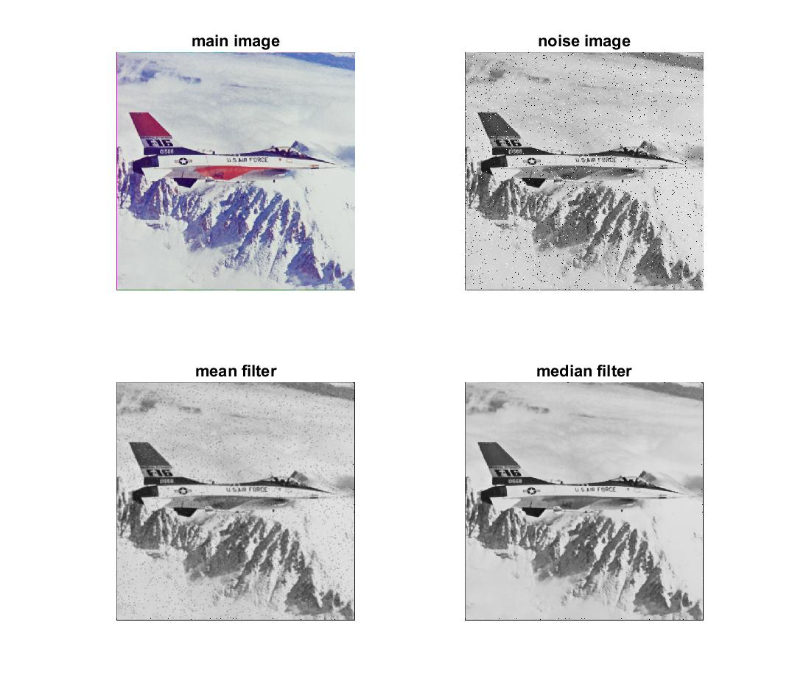

<div dir = "rtl">
  <h1> تمرین دوازدهم</h1>
  </div>
  
  ````
clc;
clear;
close all;

  ````
  <div dir = "rtl">
  خواندن تصویر و تبدیل کردن به خاکستری و به دست آوردن اندازه  عکس
  </div>
  
  ````
image = imread('airplane.png');
im = rgb2gray(image);
[m,n]=size(im); 

````

  <div dir = "rtl">
 ایجاد نویز فلفل نمکی
</div>

````
x = randi([0 ,255] , m ,n);
im(x<=0+2)=0;
im(x>=255-2)=255;

````

 <div dir = "rtl">
 
  ایجاد تصویر خام با دو سطر و ستون اضافه به منظور بدست آوردن همسایه ها در محاسبه فیلتر های میانگین و میانه 
</div>

 ```` 

[m ,n ] = size(im);
%mean & median filter
image_result = zeros(m+2, n+2);
for i=1:m
    for j=1:n
        image_result(i+1,j+1)=im(i,j);
    end
end
image_result= uint8(image_result);
image_result1=image_result;

`````

<div dir = "rtl">
 
   در ایتدا 9 همسایه را در متغیر m  قرار می دهیم 
</div>

````
for i = 2 : m-1
    for j = 2 : n-1
        m(1:3) = image_result(i-1,j-1:j+1);
        m(4:6) = image_result(i,j-1:j+1);
        m(7:9)=image_result(i+1,j-1:j+1);
````

<div dir = "rtl">
 
میانگین 9 همسایه را حساب کرده و جایگزین پیکسل می نمایم.
</div>

````
        p1 =double(m(1))+double(m(2))+double(m(3));
        p2 =double(m(4))+double(m(5))+double(m(6));
        p3 =double(m(7))+double(m(8))+double(m(9));
        temp = round ((p1+p2+p3)/9);
        image_result(i-1,j-1) = uint8(temp);
````

<div dir = "rtl">
 
9 همسایه را مرتب نموده و عنصر 5 را جایگزین پیکسل می نماییم
</div>

````
S = sort(m);
        image_result1(i-1,j-1) = S(5);
    end
end
````

<div dir = "rtl">
 
بدست آوردن میانگین پیکس ها و نمایش خروجی
</div>

````
%calculate
noise = round(mean(mean(im)));
me = round(mean(mean(image_result)));
medi = round(mean(mean(image_result1)));

%show
disp (['Noise: ' , num2str(noise)]);
disp (['Mean: ' , num2str(me)]);
disp (['Median: ' , num2str(medi)]);

%show
subplot(2,2,1);imshow(image);title('main image');
subplot(2,2,2);imshow(im);title('noise image');
subplot(2,2,3);imshow(image_result);title('mean filter');
subplot(2,2,4);imshow(image_result1);title('median filter');
````



