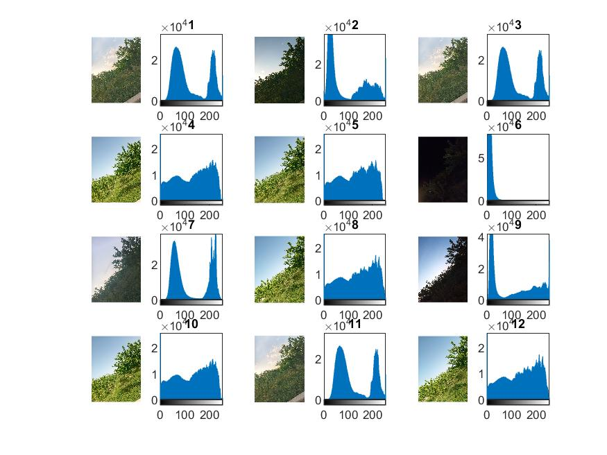

<div dir= "rtl">
  <h1> تمرین چهاردهم</h1>
  </div>
  
  ````
  clc
clear
close all

````

<div dir= "rtl">
 خواندن یکی تصویر ها از پوشه dataset.لازم به ذکر است شماره عکس ها از 1 تا 12 می باشد.
  </br>
  با دستور subplot ابتدا خود عکس سپس هیستوگرام آن نمایش داده می شود.
  </div>


````
p=1;
for i=1:12
dataset=imread("dataset/"+int2str(i)+".jpg");
figure(1);
subplot(4,6,p),imshow(dataset); 
subplot(4,6,p+1),imhist(dataset);
title(i);
p =p+2;
end
````
  
