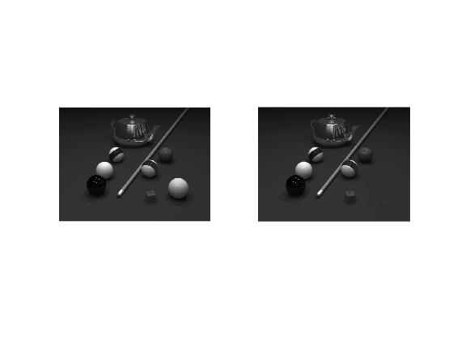

<div dir= "rtl">
  <h1> تمرین پانزدهم</h1>
  </div>
  
  ````
  clc
clear
close all

````

<div dir= "rtl">
 تبدیل عکس به خاکستری
  </div>


````
a=imread('img/pool.png');
b=rgb2gray(a);
a=rgb2gray(a);
````
<div dir= "rtl">
 در مکان توپ زرد مقدار رنگ زمینه را قرار می دهیم
  </div>
  
  ````
 for i= 230:330
    for j=360:460
        b(i,j) = 48; % عدد رنگ زمینه 
    end
end 
  
  
  `````
<div dir= "rtl">
 نمایش خروجی
</div>
  
  
 
