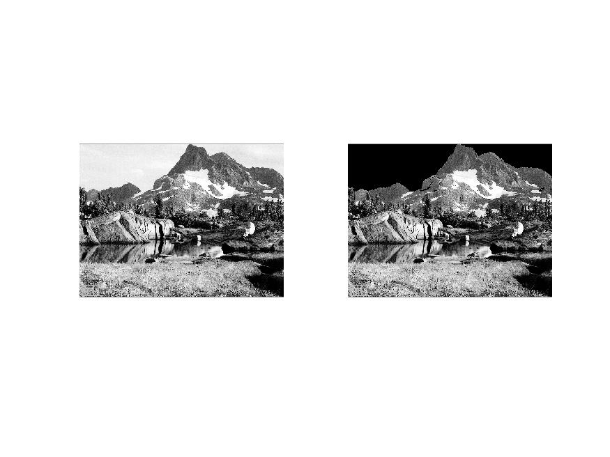
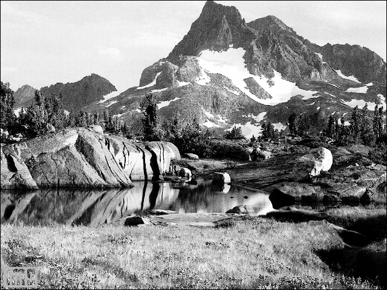

<div dir= "rtl">
  <h1> تمرین هفدهم </h1>
  </div>
  
````    
clc;
clear;
close all;

````

<div dir= "rtl">
  خواندن تصویر و با توجه به اینکه تصویر آسمان تا ردیف 150 وجود دارد اگر مقدار پیسکل از 200 کمتر بود آن را سیاه نماید.
  </div>

````
a=imread("mountain.png");
[m,n] =size(a);
for i=1:150
    for j=1:639
        if (a(i,j))>200
            a(i,j)=0;
        end
        
    end
end

`````

<div dir= "rtl">
  نمایش خروجی
  </div>
  
  `````
 imshow(a);
 
`````



