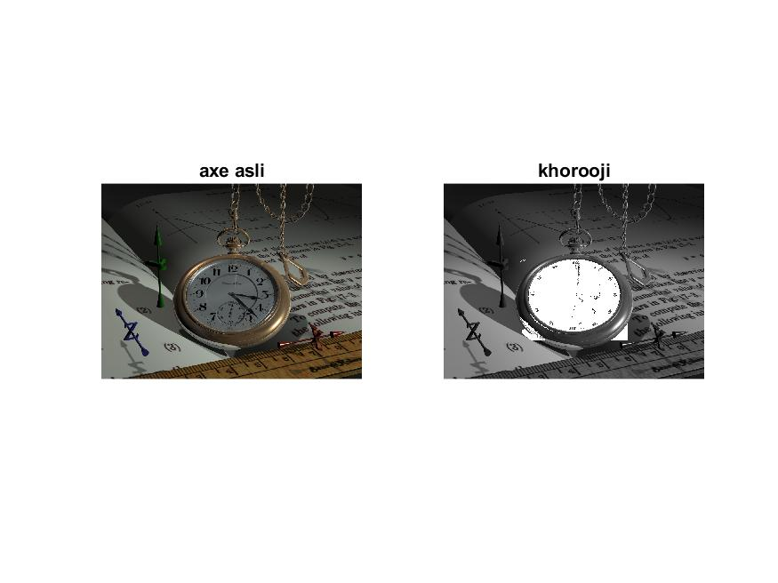

<div dir= "rtl">
  <h1> تمرین هجدهم </h1>
  </div>
  
````    
clc;
clear;
close all;

````

<div dir= "rtl">
خواندن تصویر و تبدیل به خاکستری نمودن تصویر و بدست آوردن اندازه تصویر
</div>

````
pic = imread('watch.png');
pic2= rgb2gray(pic);
subplot(1,2,1), imshow(pic), title('axe asli');
[m , n ] = size (pic2);

`````

<div dir= "rtl">
مکان تقریبی قرار گرفتن در ساعت را در نظر می گیریم و محدوده رنگ مورد نظر را بررسی نموده و پیکسل ها را سفید می نماییم.
</div>
  
  `````
  
  for i=300:m-150
    for j=300:n-300
        r=pic(i,j,1);
        g=pic(i,j,2);
        b=pic(i,j,3);
         if((abs(r-b)<3) && (abs(r-g)<3)&&(abs(b-g)<10))
              pic2(i,j)=255;
        end 
    end
end    
`````
<div dir= "rtl">
نمایش خروجی
</div>

`````
subplot(1,2,2), imshow(pic2), title('khorooji');
 
`````


