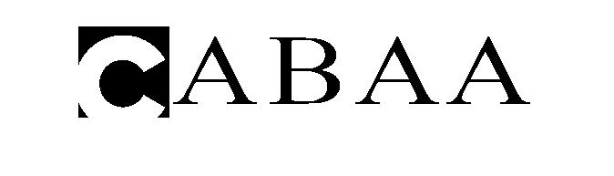

<div dir = "rtl">
<h1> تمرین نوزدهم</h1>

<br/>
</div>

````
clc
close all
clear
````
<div dir = "rtl">

  ایجاد یک تصویرکپچای 100 در 500  و جدا کردن هر قسمت به اندازه 100 و رسم خط راست بین آن ها
</div>

````
pic=zeros(100,500);
pic(1:100,100)=1;
pic(1:100,200)=1;
pic(1:100,300)=1;
pic(1:100,400)=1;
````

<div dir = "rtl">
چهار عدد تصادفی ایجاد نموده و از پوشه که نام فایل ها با شماره عدد مشخص شده است خوانده می شود.
</div>


````
for i=1:5
d=randi([0 3]);
   add="char\"+int2str(d)+".png";
   a=imread(add);
   for r=1:100
       for k=1:100
           c=(i-1)*100+k;
           pic(r,c)=255-a(r,k);
       end    
   end
end

````

<div dir = "rtl">
نمایش خروجی
</div>

````
imshow(pic)
````


