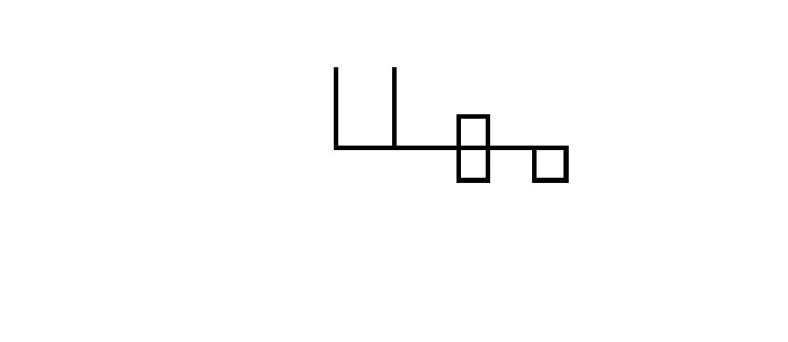

<div dir = "rtl">
<h1> تمرین بیستم</h1>

<br/>
</div>

````
clc
close all
clear
````
<div dir = "rtl">
ایجاد یک ماتریس ۲۰۰ در ۵۰۰
</div>

````
name=ones(200,500);
````

<div dir = "rtl">
سپس، پیکسل های مربوط به اسم را سیاه می نماییم.
</div>


````
name (97:100 , 200:400)=0;
%%  ساخت حرف م
name(100:125 , 397:400) = 0;
name(125:128 , 370:400) = 0;
name(100:125 , 370:373) = 0;

%% ساخت حرف ه
name(70:125 , 305:308) = 0;
name(70:125 , 330:333) = 0;
name(125:128 , 305:333) = 0;
name(70:73 , 305:333) = 0;

%% ساخت حرف ل

name(30:100 , 250:253) = 0;

%% ساخت حرف آخر

name(30:100 , 200:203) = 0;

imshow(name);

````

<div dir = "rtl">
نمایش خروجی
</div>

````
imshow(name);
````


