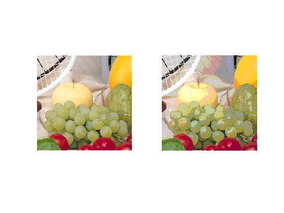

<div dir = "rtl">
<h1> تمرین بیست و یکم</h1>

<br/>
</div>

````
clc
close all
clear
````
<div dir = "rtl">
خواندن تصویر
</div>

````
pic = imread("../../../benchmark/fruits.png");
image =pic;
````

<div dir = "rtl">
ابتدا با تقسیم بر 51 مشخص می شود در کدام رنج قرار میگیرد</br>
 سپس در با ضرب در 51 مقدار safe code را بدست می آوریم
</div>


````
 image(:,:,1)= ((image(:,:,1)/51))*51;
image(:,:,2)= ((image(:,:,2)/51))*51;
image(:,:,3)= ((image(:,:,3)/51))*51;

````

<div dir = "rtl">
نمایش خروجی
</div>

````
 subplot(1,2,1), imshow(pic);
  subplot(1,2,2), imshow(image);
````


